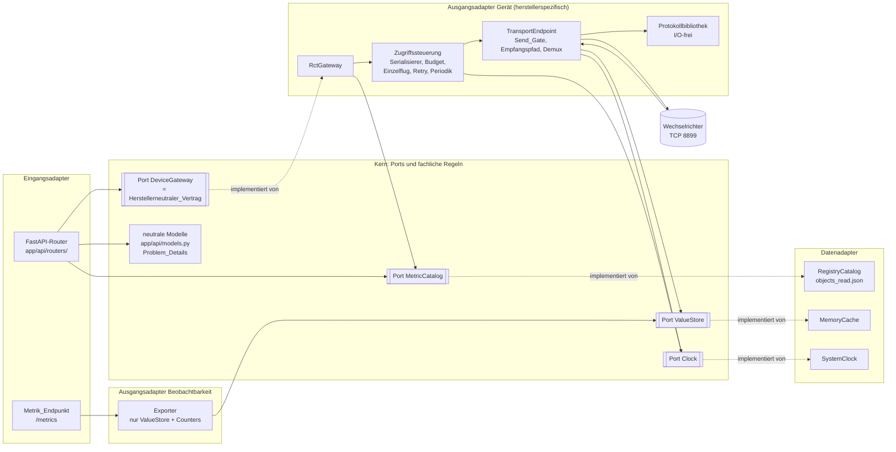
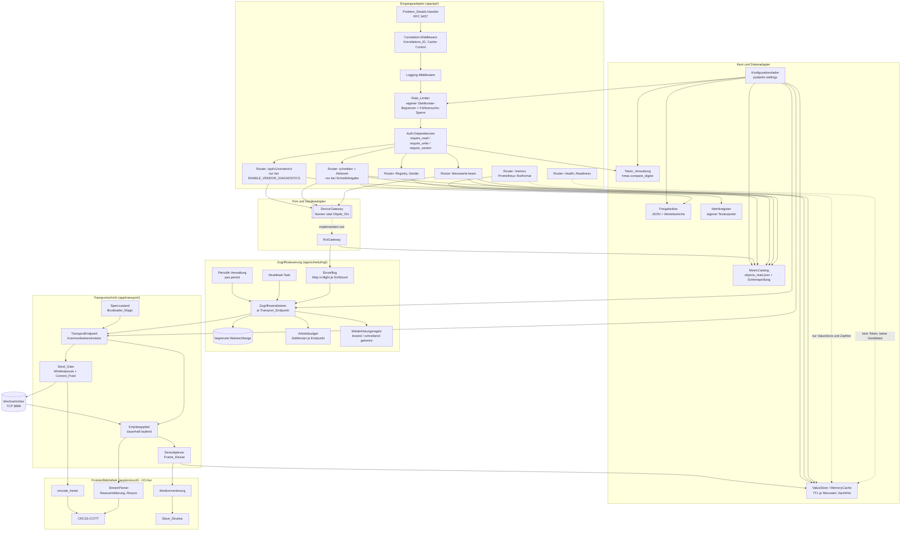
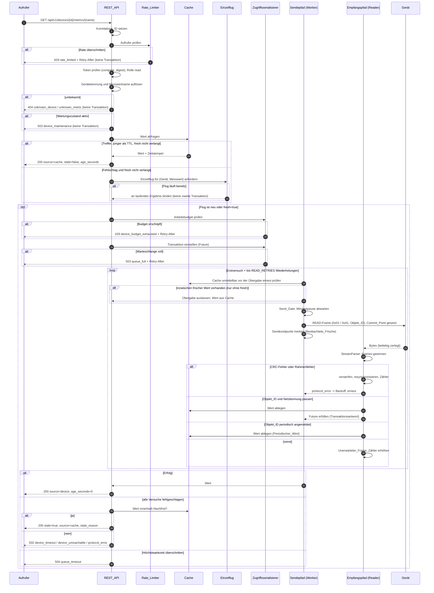
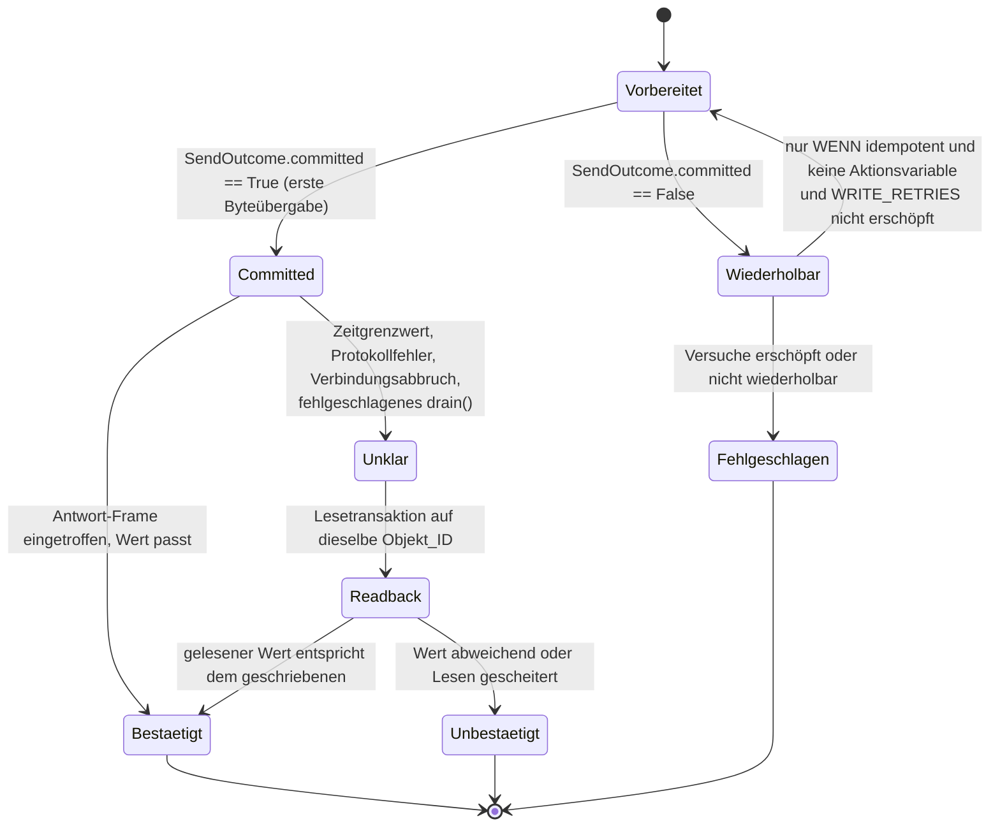

# Design Document

## Overview

`rct-manager/` wird ein eigenständiges Projekt dieses Monorepos nach dem Muster der
neueren Dienste (`talsperren`, `tanken`, `wartezeiten.app`): ein Paket `app/`,
startbar über `python -m app`, Abhängigkeiten und Version ausschließlich in
`pyproject.toml`, Auslieferung als gehärtetes Container_Image
`docker.cirrio.de/rct-api`.

Der Dienst hat zwei Gesichter, und die Vertragsgrenze des Requirements-Dokuments
beschreibt genau diese Asymmetrie. Nach außen ist er eine gewöhnliche,
token-geschützte FastAPI-Anwendung: JSON über HTTP, OpenAPI-Beschreibung,
Ratenbegrenzung, Problem_Details nach RFC 9457, ein Prometheus-kompatibler
Metrik_Endpunkt. Nach innen ist er ein Gateway zu einem Gerät ohne
Zugangskontrolle, ohne Parallelitätstoleranz und ohne Plausibilitätsprüfung.

Daraus folgt die Grundform des Entwurfs: **die HTTP-Seite ist nebenläufig, die
Transportseite ist je Transport_Endpunkt strikt seriell, und dazwischen sitzen eine
Warteschlange, ein Arbeitsbudget, ein Einzelflug und ein Cache.** Jede
Entwurfsentscheidung dieses Dokuments ist gegen die vier Grenzen des Abschnitts
„Architekturprinzip und Vertragsgrenze“ geprüft.

### Abbildung der vier Vertragsgrenzen auf den Entwurf

Je Grenze ist genau benannt, welcher Entwurfsbestandteil sie durchsetzt. „Durchsetzt“
heißt hier: es gibt keinen zweiten Weg, der sie umgehen könnte.

| Grenze | Durchsetzender Entwurfsbestandteil | Prüfstelle |
|---|---|---|
| **Kapselungsgrenze** | Der Port `DeviceGateway` in `app/gateway/base.py` kennt ausschließlich Messwertnamen und Gerätekennungen. Objekt_ID, Command-Byte, Netzkennung, Transportadresse und Protokoll-Datentyp erscheinen in keinem Modell unter `app/api/models.py`; sie leben in `app/protocol/`, `app/catalog/` und ausschließlich für den Diagnosebereich in `app/api/models_vendor.py` | Requirement 30.1–30.3, 30.17, 30.21; Property 12 |
| **Schonungsgrenze** | Genau eine Methode löst Gerätelast aus: `TransportEndpoint.execute()`. Metrik_Endpunkt, Dokumentations_Endpunkte, Health_Endpunkt und jede abgewiesene Anfrage haben keinen Aufrufpfad dorthin — der Exporter bekommt nachweislich nur `Cache` und `EndpointCounters` injiziert | Requirement 20.2–20.5, 30.15, 30.16, 30.22; Properties 9, 10, 13 |
| **Eigentumsgrenze** | `TransportEndpoint` ist die Kommunikationsinstanz und alleiniger Eigentümer von `StreamReader`/`StreamWriter`. Kein anderes Modul ruft `asyncio.open_connection` auf; `SendGate.send()` ist die einzige Aufrufstelle von `writer.write` | Requirement 24.1–24.5, 24.13; Properties 7, 8 |
| **Austauschbarkeitsgrenze** | Die HTTP-Schicht hängt ausschließlich am Port `DeviceGateway` und am Port `MetricCatalog`, nicht am Adapter `RctGateway`. Die Zuordnung Port → Adapter geschieht einmalig im Lifespan | Requirement 30.17, 30.18; Property 12 |

### Leitentscheidungen

| Entscheidung | Begründung |
|---|---|
| Eigener Frame_Codec aus reinen Funktionen, ohne Fremdbibliothek | Requirement 1.16; erlaubt Property-Based Testing des Round-Trips (1.15) und der Stream-Zerlegung (2.12) ohne Gerät und ohne I/O-Attrappe |
| Je Transport_Endpunkt **ein** Worker-Task (Sendepfad) **und ein** Reader-Task (Empfangspfad), nicht ein `asyncio.Lock` um einen gemeinsam genutzten Socket | Periodische Frames treffen unaufgefordert ein (Requirement 3.1, 3.5). Der Empfangspfad muss **demultiplexen**, nicht „die nächste Antwort“ lesen. Das verlangt genau einen Eigentümer des Lesestroms. |
| Serialisierungs- und Eigentumseinheit ist der **Transport_Endpunkt**, nicht das Gerät | Requirement 6.9 und 24.1: Master und alle seine Slaves teilen eine TCP-Verbindung und sind gegeneinander zu serialisieren. Eine Modellierung je Gerätekennung würde diese Zusage verletzen. |
| Send_Gate als letzte Stelle vor `writer.write`, nicht als Pause „zwischen Transaktionen“ | Requirement 24.6–24.8: Wiederholversuch, Read-back, Heartbeat, Periodik-Anmeldung und Abbau sind keine Ausnahmen. Die Invariante gehört an die Stelle, die niemand umgehen kann. |
| **Commit_Point** am Send_Gate, unmittelbar vor der ersten Byteübergabe | Requirement 9.2–9.5, 24.11: Auf TCP ist nicht beobachtbar, ob ein geschriebener Frame das Gerät erreicht hat. Die Grenze der Wiederholbarkeit muss deshalb an einer *beobachtbaren* Stelle liegen, und das ist allein der Übergabezeitpunkt. |
| Empfangspuffer wird **nicht** pauschal vor jedem Senden verworfen | Requirement 3.9/3.10 verbieten das ausdrücklich, sobald Periodik aktiv ist. Ein Drain wäre mit `READ PERIODICALLY` unvereinbar. Stattdessen übernimmt der Demultiplexer die Zuordnung. |
| Periodik ist **nicht** an die Schreibfreigabe gekoppelt, sondern an `ENABLE_PERIODIC_READS` | Requirement 17.8–17.10: `pas.period` ist ein System_Schreibzugriff auf eine fest verankerte Liste und unabhängig von `ENABLE_WRITE_SUPPORT`. Keine von außen auslösbare Schreibfläche. |
| Einzelflug je `(Gerätekennung, Messwertname)` | Requirement 15.12–15.15: N gleichzeitige Anfragen auf denselben abgelaufenen Messwert dürfen nicht N identische Transaktionen in die Warteschlange legen. |
| Aktionsvariablen haben einen eigenen `POST`-Endpunkt | Requirement 19.6–19.9: `PUT` sagt einen Zustand zu, den eine Aktionsvariable nicht garantiert. Die fehlende Bestätigung wird im Vertrag sichtbar. |
| Objekt_Registry und Freigabeliste als JSON-Dateien neben dem Code | Requirement 4.17, 19.23; folgt der Konvention `rctpower/metrics.json` („Metrik-Auswahl ist Daten, nicht Code“) |
| Transaktionen werden bei HTTP-Client-Abbruch **nicht** abgebrochen, sondern zu Ende geführt | Ein Abbruch zwischen Senden und Empfangen hinterlässt eine Antwort im Strom, die der Demultiplexer dann als `Unerwarteter_Frame` zählt und die den Verdacht auf Fremdzugriff verfälscht (Requirement 29.4). Zu Ende führen ist billiger. |

### Protokollquelle und Provenienz

Normative Quelle ist
`docs/reference/6707-RCT-Power-Serial-Communication-Protocol.pdf` (Dokumentversion
1.14 vom 11.02.2022). Für die vorliegende Dokumentenprüfung stand kein
PDF-Textextraktor zur Verfügung; die PDF wurde daher nicht erneut vollständig geprüft. Alle in diesem Entwurf genannten Protokolldetails stammen deshalb aus
der normativen Wiedergabe in `requirements.md` — insbesondere aus dem Abschnitt
„Prüfung der Review-Befunde“, der Quellenlage, Ableitungen und offene Annahmen
einzeln ausweist — sowie aus der erprobten Praxis in
`rctpower/source/rct_inverter/`.

Vor der Produktivsetzung sind die als **Ableitung** oder
**begründete Annahme** gekennzeichneten Punkte am Gerät zu verifizieren (Aufgabe 16.1).
Die Implementierung und lokale Tests können mit ausdrücklich dokumentierten Annahmen beginnen. Sie sind
hier zusammengezogen, weil kein Test gegen eine selbst gebaute Attrappe sie findet:
Attrappe und Codec würden denselben Irrtum teilen.

| Offene Protokollannahme | Quelle im Requirements-Dokument | Entwurfsvorkehrung |
|---|---|---|
| CRC-Bytes werden escapet | Befund 8; in 296 Frames und 168 CRC-Werten trat `0x2B`/`0x2D` nicht auf, daher offen | Escaping ist eine eigene Funktion `escape_body()`, am Gerät umschaltbar ohne Eingriff in die CRC-Berechnung |
| Frame-Aufbau von `0x08`/`0x48` entspricht dem Standard_Frame bzw. Plant_Frame | Befund 9 | `encode_frame` behandelt `READ_PERIODICALLY` nicht gesondert; eine Abweichung wäre eine Änderung an einer Stelle |
| Bytebreite von `t_enum` (4) und `t_bool` (1) | Befund 5, 15 | Feld `byte_width` je Registry-Eintrag übersteuert die Vorgabebreite (Requirement 4.7–4.10) |
| Zeichenkodierung der Zeichenketten | Befund 13 | Einstellung `STRING_ENCODING`, Vorgabe `utf-8`, Ersetzung statt Abbruch |
| `net.slave_data` ist Struktur, nicht `t_string` | Befund 4, 14 | Eigener Datentyp `t_struct` mit abschließender Strukturkennung `slave_data` |

### Übernommene Praxis aus `rctpower/source/rct_inverter/`

Die dortige Implementierung ist die einzige in diesem Repository erprobte Erfahrung
mit dem Gerät. Übernommen werden:

1. **Objekt_ID-Prüfung jeder Antwort.** Eine Antwort mit fremder Objekt_ID ist nicht
   die eigene Antwort. Hier wird daraus die Frame_Klassen-Zuordnung des
   Demultiplexers (Requirement 3.2–3.8).
2. **Entschleunigung.** 300 ms zwischen Sendevorgängen desselben Endpunkts; die
   interne serielle Brücke des Geräts reagiert auf schnelle Folgen mit Pufferung und
   veralteten Antworten. Hier als Send_Gate (Requirement 24.6).
3. **Socket-Optionen und garantiertes Schließen.** `managed_socket_connection()` setzt
   `TCP_NODELAY`, `SO_KEEPALIVE`, Zeitgrenzwerte auf connect/recv/send und schließt im
   `finally`. Hier dasselbe auf dem rohen Socket des `StreamWriter`, mit dem Schließen
   im Abbau des Lifespan (Requirement 8.9).
4. **Ein unlesbarer Messwert scheitert nicht den ganzen Abruf.** Dort gibt
   `_read_single_metric()` `None` zurück und der Zyklus läuft weiter; hier ist es das
   Feld `errors` der Sammelantwort (Requirement 10.15).

**Nicht** übernommen wird `_drain_socket()`. Der pauschale Puffer-Drain ist in
`rct_inverter` richtig, weil dort keine Periodik eingeschaltet wird und jeder fremde
Frame tatsächlich Abfall ist. Requirement 3.9 und 3.10 untersagen ihn hier: er würde
angemeldete periodische Werte verwerfen. Den Zweck übernimmt der Demultiplexer, den
Ausnahmefall die Resynchronisation des Stream_Parser.

Ebenfalls nicht übernommen wird die Struktur: `rct_inverter` ist synchron, nutzt
`threading.Lock` und `select`, lebt in einem Ein-Minuten-Zyklus und verwendet
`rctclient`. Dieser Dienst ist ein dauerhaft laufender asynchroner Server ohne
Fremdbibliothek für das Protokoll.

## Architecture

### Ports und Adapter statt linearer Schichten

Der frühere Entwurf beschrieb sechs strikt linear übereinander liegende Schichten,
„jede nur von der darunterliegenden abhängig“. Diese Beschreibung war unehrlich: der
Adapter `RctGateway` löst Messwertnamen über die Objekt_Registry auf und hängt damit
an einer nominell *höheren* Schicht. Dieselbe Verletzung tritt am Cache auf, den
sowohl der Demultiplexer als auch die HTTP-Schicht beschreiben.

Der Entwurf verhält sich tatsächlich **hexagonal**, und so wird er hier auch
beschrieben. Es gibt einen fachlichen Kern mit Ports, Adapter an den Rändern und eine
Abhängigkeitsumkehr an genau diesen Ports.

**Ports (Schnittstellen, definiert im Kern, implementiert außen):**

| Port | Definiert in | Bedeutung | Implementiert von |
|---|---|---|---|
| `DeviceGateway` | `app/gateway/base.py` | Gerätezugriff über Messwertnamen, ohne jedes Protokolldetail. Dies ist der Herstellerneutrale_Vertrag in Codeform | `RctGateway` (`app/gateway/rct.py`) |
| `MetricCatalog` | `app/catalog/base.py` | Namensauflösung, Einheit, neutraler Werttyp, Schreibbarkeit, Vorauswahl | `RegistryCatalog` (`app/catalog/registry.py`), gelesen aus `objects_read.json` |
| `ValueStore` | `app/cache.py` | Ablegen und Lesen von Messwerten mit Zeitstempel und Herkunft | `MemoryCache` |
| `Clock` | `app/clock.py` | Zeitquelle für Send_Gate, Cache, Budget und Abbaufrist | `SystemClock`, in Tests `ManualClock` |

**Adapter (hängen am Port, nie umgekehrt):**

- **Eingangsadapter:** die FastAPI-Router unter `app/api/routers/`. Sie kennen
  `DeviceGateway` und `MetricCatalog`, aber nicht `RctGateway`, nicht
  `AccessSerializer` und nicht `TransportEndpoint`.
- **Ausgangsadapter Gerät:** `RctGateway` plus `app/scheduling/`, `app/transport/`
  und `app/protocol/`. Dieser Adapter darf die Objekt_Registry benutzen — er ist der
  einzige Ort, an dem ein Messwertname auf eine Objekt_ID trifft.
- **Ausgangsadapter Beobachtbarkeit:** `app/observability/exporter.py`. Er bekommt
  `ValueStore` und `EndpointCounters` injiziert und hat keinen Verweis auf
  `DeviceGateway` oder `AccessSerializer`. Das ist die Schonungsgrenze als
  Konstruktorsignatur.

**Wo die Abhängigkeitsumkehr stattfindet.** An genau drei Stellen:

1. Die HTTP-Schicht ruft `DeviceGateway`, nicht `RctGateway`. Die Zuordnung geschieht
   einmalig im Lifespan (`app/api/app_factory.py`) und wird über
   `app.dependency_overrides`-fähige Provider injiziert. Ein Austausch des
   Geräteadapters berührt keinen Router (Requirement 30.17).
2. Der Demultiplexer schreibt in `ValueStore`, nicht in eine konkrete Cache-Klasse —
   deshalb ist „periodischer Wert landet im Cache“ (Requirement 3.5) ohne Rückgriff
   auf die HTTP-Schicht testbar.
3. Send_Gate, Cache und Budget nehmen `Clock`. Nur so sind die zeitlichen
   Eigenschaften (Properties 7 und 17) ohne Realzeit prüfbar.

Die **Protokollschicht** `app/protocol/` ist kein Adapter, sondern eine reine
Bibliothek: Kodieren, Dekodieren, CRC, Escaping, Stream-Zerlegung, Wertkonvertierung,
Slave_Struktur. **Kein I/O, kein Socket, keine Uhr, keine Nebenläufigkeit.** Die
Begründung ist Testbarkeit: die Round-Trip-Eigenschaft (Requirement 1.15) und die
Zerlegungs-Eigenschaft (Requirement 2.12) sind Aussagen über alle Eingaben. Sie sind
nur mit Hypothesis prüfbar, wenn diese Schicht ohne Ereignisschleife auskommt.



Die gestrichelten Kanten sind die Umkehrungen: der Pfeil der *Benutzung* zeigt von
links nach rechts, der Pfeil der *Abhängigkeit* bei diesen drei Kanten von rechts
nach links. Deshalb kann `RctGateway` den Catalog benutzen, ohne dass die HTTP-Schicht
etwas von `RctGateway` weiß.

### Komponentenstruktur



### Zuordnung Gerät, Gerätegruppe und Transport_Endpunkt

Diese Zuordnung ist die häufigste Fehlerquelle des Entwurfs und deshalb ausdrücklich
festgelegt (Requirement 6.9, 7.8, 24.1):

- Ein **Transport_Endpunkt** ist das Paar aus Zieladresse und Zielport. Ihm gehört
  genau eine `TransportEndpoint`-Instanz, genau eine TCP-Verbindung, genau eine
  Warteschlange, genau ein Send_Gate, genau ein Arbeitsbudget und genau ein
  Empfangspfad. Nach außen trägt er ausschließlich seine **Endpunktkennung** — eine
  konfigurierte, über die Laufzeit stabile Kennung ohne Adresse und ohne Port
  (Requirement 20.19).
- Eine **Gerätegruppe** ist die Menge der Geräte eines Transport_Endpunkts: das
  unmittelbar angebundene Gerät plus alle über dessen Anlagennetz adressierten
  Slave-Geräte.
- Ein **Gerät** ist eine Gerätekennung aus der Konfiguration. Es besitzt keine
  Verbindung, sondern verweist auf seinen Transport_Endpunkt und trägt gegebenenfalls
  eine Netzkennung.

Die Konfiguration `DEVICES` mit Einträgen der Form `kennung=host:port[@netzkennung]`
wird beim Start zu Transport_Endpunkten verdichtet: Einträge mit gleichem `host:port`
landen in derselben Gruppe. Die Endpunktkennung wird aus der Gerätekennung des
unmittelbar angebundenen Geräts abgeleitet und ist damit frei von Transportangaben.
Die Anzahl der Endpunkte und Geräte wird beim Start protokolliert (Requirement 7.7).

### Ablauf einer Leseanfrage



### Verzeichnis- und Modulaufbau

```
rct-manager/
├── app/
│   ├── __init__.py
│   ├── __main__.py                 # CLI: serve | validate
│   ├── banner.py                   # Versionsbanner
│   ├── clock.py                    # Port Clock, SystemClock
│   ├── config.py                   # Settings nach Konfigurationsvertrag
│   ├── logging_setup.py            # strukturierte Ausgabe auf stdout
│   ├── errors.py                   # interne Fehlerhierarchie -> Fehlerschlüssel
│   ├── allowlist.py                # Freigabeliste laden und prüfen
│   ├── cache.py                    # Port ValueStore, MemoryCache
│   ├── catalog/
│   │   ├── __init__.py
│   │   ├── base.py                 # Port MetricCatalog, neutrale Deskriptoren
│   │   └── registry.py             # RegistryCatalog aus objects_read.json
│   ├── protocol/
│   │   ├── __init__.py
│   │   ├── types.py                # Command, DataType, FrameKind
│   │   ├── crc.py                  # CRC16-CCITT
│   │   ├── escaping.py             # escape_body, unescape_body
│   │   ├── frames.py               # Frame, encode_frame, decode_frame
│   │   ├── stream.py               # StreamParser (inkrementell, I/O-frei)
│   │   ├── values.py               # decode_value, encode_value
│   │   └── slave_data.py           # Slave_Struktur, 108 Byte
│   ├── transport/
│   │   ├── __init__.py
│   │   ├── endpoint.py             # TransportEndpoint = Kommunikationsinstanz
│   │   ├── types.py                # Transport-Transaktionen und Ergebnisse
│   │   ├── send_gate.py            # SendGate, Commit_Point
│   │   ├── receiver.py             # Empfangspfad
│   │   ├── demux.py                # Demultiplexer, Frame_Klasse
│   │   └── counters.py             # Zähler je Transport_Endpunkt
│   ├── scheduling/
│   │   ├── __init__.py
│   │   ├── serializer.py           # Zugriffsserialisierer, Warteschlange
│   │   ├── singleflight.py         # Einzelflug je (Gerät, Messwert)
│   │   ├── budget.py               # Arbeitsbudget
│   │   ├── retry.py                # Lese- und Schreibregeln getrennt
│   │   ├── heartbeat.py            # Heartbeat-Task
│   │   ├── periodic.py             # Periodik, pas.period
│   │   └── shutdown.py             # Abbauphasen, Abbau_Deadline, Abbaureserve
│   ├── gateway/
│   │   ├── __init__.py
│   │   ├── base.py                 # Port DeviceGateway, neutrale DTOs
│   │   ├── vendor.py               # Diagnose-DTOs
│   │   └── rct.py                  # Adapter RctGateway
│   ├── security/
│   │   ├── __init__.py
│   │   ├── tokens.py               # Token_Verwaltung, Token_Kennung
│   │   ├── dependencies.py         # require_read, require_write, require_vendor
│   │   ├── ratelimit.py            # eigener Gleitfenster-Begrenzer, Fehlversuchs-Sperre, Schlüsseltabelle, Scrape-Grenze
│   │   └── client_ip.py            # Peer_Adresse, Vertrauensliste
│   ├── observability/
│   │   ├── __init__.py
│   │   ├── names.py                # Metriknamen bilden und normalisieren
│   │   ├── stats.py                # Diagnosegrößen im Speicher
│   │   └── exporter.py             # Prometheus-Textformat aus Cache und Zählern
│   └── api/
│       ├── __init__.py
│       ├── app_factory.py          # create_app(), Lifespan, Port-Bindung
│       ├── runtime.py              # Laufzeitzustand der Anwendung
│       ├── server.py               # Uvicorn-Serversteuerung
│       ├── middleware.py           # Korrelations_ID, Cache-Control, Logging
│       ├── problems.py             # Problem_Details, Fehlerschlüssel-Tabelle
│       ├── models.py               # herstellerneutrale Antwortmodelle
│       ├── models_vendor.py        # Modelle des Diagnosebereichs
│       └── routers/
│           ├── __init__.py
│           ├── health.py           # /health, /api/v1/readiness
│           ├── catalog.py          # /api/v1/metrics, /api/v1/devices
│           ├── values.py           # lesende Messwert-Endpunkte
│           ├── writes.py           # PUT-Messwert, POST-Aktion
│           ├── metrics.py          # /metrics
│           └── vendor.py           # /api/v1/vendor/rct/*
├── objects_read.json               # Objekt_Registry (Daten, nicht Code)
├── objects_write_allowed.json      # Freigabeliste (Daten, nicht Code)
├── run.py                          # Shim nach Monorepo-Konvention
├── pyproject.toml
├── settings.env.example
├── .dockerignore
├── .gitignore
├── .trivyignore
├── README.md
├── setup.conf                    # optional, only on explicit maintainer request
├── docker/
│   ├── Dockerfile
│   ├── build.sh
│   ├── compose.yaml
│   └── README_docker.md
└── tests/
    ├── api_helpers.py
    ├── conftest.py
    ├── fakes.py
    ├── strategies.py
    ├── fixtures/
    │   ├── device_long_frames.hex
    │   └── objects.json
    ├── test_protocol_properties.py
    ├── test_stream_properties.py
    ├── test_values_properties.py
    ├── test_slave_data_properties.py
    ├── test_send_gate_properties.py
    ├── test_write_commit_properties.py
    ├── test_singleflight_properties.py
    ├── test_shutdown_properties.py
    ├── test_contract_properties.py
    ├── test_api_examples.py
    ├── test_config_validation.py
    ├── test_metrics_endpoint.py
    ├── test_auth_opt_out.py
    ├── test_budget_and_liveness.py
    ├── test_client_ip.py
    ├── test_endpoint_lock.py
    ├── test_periodic_properties.py
    ├── test_ratelimit_auth_overflow.py
    ├── test_registry_pin_and_limit_key.py
    ├── test_serve_smoke.py
    ├── test_stream_device_frames.py
    └── test_structure_smoke.py
```

## Components and Interfaces

### Protokollbibliothek — `app/protocol/`

Reine Funktionen und ein I/O-freier Parser. Kein Modulzustand, keine Uhr.

```python
# app/protocol/types.py
class Command(IntEnum):
    READ = 0x01
    WRITE = 0x02
    LONG_WRITE = 0x03
    RESPONSE = 0x05
    LONG_RESPONSE = 0x06
    READ_PERIODICALLY = 0x08
    READ_M = 0x41
    WRITE_M = 0x42
    LONG_WRITE_M = 0x43
    RESPONSE_M = 0x45
    LONG_RESPONSE_M = 0x46
    READ_PERIODICALLY_M = 0x48

PLANT_BIT = 0x40            # bit 6 marks the plant-network variant
LONG_COMMANDS = frozenset({Command.LONG_WRITE, Command.LONG_RESPONSE,
                           Command.LONG_WRITE_M, Command.LONG_RESPONSE_M})
WRITE_COMMANDS = frozenset({Command.WRITE, Command.LONG_WRITE,
                            Command.WRITE_M, Command.LONG_WRITE_M})
START_BYTE = 0x2B
STOP_BYTE = 0x2D
BOOTLOADER_MAGIC = b"\x50\xF7\x05\xAB"

class DataType(StrEnum):
    BOOL = "t_bool"
    UINT8 = "t_uint8"
    INT8 = "t_int8"
    UINT16 = "t_uint16"
    INT16 = "t_int16"
    UINT32 = "t_uint32"
    INT32 = "t_int32"
    FLOAT = "t_float"
    ENUM = "t_enum"
    STRING = "t_string"
    STRUCT = "t_struct"

class StructKind(StrEnum):
    SLAVE_DATA = "slave_data"   # the only admissible struct kind

class FrameKind(StrEnum):
    TRANSACTION_RESPONSE = "transaction_response"
    PERIODIC_VALUE = "periodic_value"
    UNEXPECTED = "unexpected"
```

`Command` deckt die in Requirement 1.9 verlangten zwölf Command-Bytes ab.
`LONG_COMMANDS` ist die in Requirement 1.10 und Befund 1 festgelegte Menge und
enthält ausdrücklich `0x06` und `0x46`, die im ursprünglichen Review-Befund fehlten.
`WRITE_COMMANDS` dient der Korrektheitseigenschaft nach Requirement 9.17: sie macht
„ein Frame mit dem Command-Byte einer Schreibtransaktion“ im Test zählbar.

```python
# app/protocol/crc.py
def crc16_ccitt(body: bytes) -> int:
    """CRC16-CCITT, polynomial 0x1021, seed 0xFFFF, zero-padded to even length."""
```

Die Null-Byte-Auffüllung bei ungerader Länge (Requirement 1.6) steckt in dieser
Funktion, nicht beim Aufrufer. So kann keine Aufrufstelle sie vergessen.

```python
# app/protocol/escaping.py
def escape_body(body: bytes) -> bytes:
    """Prefix every 0x2B and 0x2D with the stop byte 0x2D."""

def unescape_body(data: bytes) -> bytes:
    """Resolve 0x2D 0x2D and 0x2D 0x2B into one payload byte each."""
```

Escaping ist von der CRC-Berechnung getrennt, weil das eingefügte Stop-Byte nicht in
die Prüfsumme eingeht (Requirement 1.7, 1.8). `encode_frame` berechnet die CRC über
den **unescapten** Rumpf und escapet erst danach — Rumpf **und** CRC-Bytes.

```python
# app/protocol/frames.py
@dataclass(frozen=True, slots=True)
class Frame:
    command: Command
    object_id: int
    payload: bytes = b""
    plant_address: int | None = None     # set -> plant frame, 4-byte address field

    @property
    def is_plant(self) -> bool: ...

def encode_frame(frame: Frame) -> bytes:
    """Serialise: start byte, escaped body, escaped CRC."""

def decode_frame(body: bytes, *, measured_length: bool = False) -> Frame:
    """Decode one unescaped frame body. Raises FrameError on CRC or length mismatch."""
```

Das Längenfeld ist 1 Byte, bei einem Long_Command 2 Byte in MSBF-Reihenfolge
(Requirement 1.10, 1.11). Beim Plant_Frame umfasst es `[Address, ID, Data]`, also
8 + Länge der Nutzdaten (Requirement 1.2), und die CRC-Eingabe ist
`[Command, Length, Address, ID, Data]` (Requirement 1.5). Beim Standard_Frame umfasst
das Längenfeld `[ID, Data]` und die CRC-Eingabe ist `[Command, Length, ID, Data]`
(Requirement 1.1, 1.4). Diese Unterscheidung ist die häufigste Fehlerquelle des
Codecs und daher in beiden Richtungen durch dieselbe Hilfsfunktion `_body_parts()`
abgedeckt, die Encoder und Decoder gemeinsam nutzen.
Bei empfangenen langen Frames ist das Längenfeld am Gerät nicht verlässlich;
bei Abweichungen gewinnt der Parser die Grenze aus der Rahmung und prüft die CRC
mit den unveränderten empfangenen Längenbytes erneut.

```python
# app/protocol/stream.py
@dataclass(slots=True)
class ParseStats:
    discarded_bytes: int = 0
    crc_errors: int = 0
    framing_errors: int = 0
    oversize_frames: int = 0
    length_field_corrected: int = 0
    unknown_commands: int = 0
    last_unknown_command: int | None = None

class StreamParser:
    """Incremental frame extraction from a TCP byte stream. Stateful, I/O-free."""

    def __init__(self, *, max_frame_bytes: int = 4096) -> None: ...
    def feed(self, chunk: bytes) -> list[Frame]: ...
    def reset(self) -> None: ...
    @property
    def stats(self) -> ParseStats: ...
    @property
    def buffered_bytes(self) -> int: ...
    @property
    def bootloader_magic_seen(self) -> bool: ...
```

`StreamParser` ist das Herz von Requirement 2. Verhalten im Einzelnen:

- **Reassemblierung** über Lesevorgänge hinweg: angefügte Bytes bleiben im Puffer,
  bis ein Frame vollständig ist (Requirement 2.1, 2.3). Mehrere Frames in einem
  `feed()` kommen in Empfangsreihenfolge zurück (2.2).
- **Geteilte Escaping-Sequenz**: ein Stop-Byte am Pufferende bleibt liegen, bis das
  Folgebyte eintrifft (2.4).
- **Führendes Null-Byte** vor dem Start-Byte wird überlesen (2.5).
- **Resynchronisation**: Bytes vor dem ersten Start-Byte werden verworfen und
  gezählt (2.6). Ein unmaskiertes `0x2B` innerhalb eines unvollständigen Frames
  verwirft den begonnenen Frame und beginnt einen neuen (2.7). Die Suche ist
  escape-bewusst und beginnt am verworfenen Frame.
- **Korrektur langer Frames**: Weicht das empfangene Längenfeld von der Rahmung ab,
  prüft der Parser die kürzere Grenze ohne trennendes Null-Byte zuerst und gibt
  nur CRC-gültige Frames zurück (2.13–2.15).
- **Ungültige Escaping-Sequenz** (Stop-Byte vor einem anderen Byte als `0x2B`/`0x2D`)
  verwirft den Frame, zählt einen Rahmenfehler und resynchronisiert (2.8).
- **Höchstgröße** `MAX_FRAME_BYTES`, Vorgabe 4096: ein größerer Frame wird verworfen,
  mit Command-Byte und gemeldeter Länge protokolliert, dann resynchronisiert
  (2.9, 2.10). Als Anhaltspunkt dient die Aussage der Quelle, dass Variablen bis
  251 Byte mit dem gewöhnlichen `RESPONSE` beantwortet werden.
- **CRC-Fehler** erzeugen keine Ausnahme nach außen: der Frame wird verworfen und
  `stats.crc_errors` erhöht; der Aufrufer entscheidet über Protokollierung und
  Wiederholung (Requirement 1.13, 1.14).
- **Bootloader_Magic** wird auf dem rohen Strom erkannt, nicht als Frame. Das ist
  Befund 3: die Folge trägt keine Objekt_ID und steht außerhalb des Frame-Aufbaus.
  `bootloader_magic_seen` ist das Signal an den Transport (Requirement 8.11). Gesucht
  wird ausschließlich in Bytes, die nachweislich **außerhalb** eines Frames liegen,
  also in den vor einem Start-Byte verworfenen Bytes. Eine Suche über den gesamten
  TCP-Block würde die Folge auch in der Nutzlast eines gültigen Frames finden und den
  Endpunkt fälschlich in den Sperrzustand versetzen. Ein über zwei Lesevorgänge
  geteiltes Magic bleibt über einen Übertrag von drei Bytes erkennbar; der Übertrag
  wird an einem Frame-Anfang verworfen, damit er keine Fundstelle über eine
  Frame-Grenze hinweg erzeugt.
- **Protokollierungsdichte.** Unbekannte Command-Bytes, Übergrößen und CRC-Fehler
  werden je Verbindung gezählt und nur abgetastet protokolliert: die ersten drei
  Vorkommen und danach Zweierpotenzen. Ein gestörter oder bösartiger Gegenüber kann
  CRC-ungültiges Material beliebig lange senden, und die Eskalation nach
  Requirement 3.11 greift dafür nicht. Zählerstände und Resynchronisation bleiben
  unverändert; begrenzt wird ausschließlich die Protokollmenge.
  Protokollfremde Bytes werden im `Receiver` gezählt und ratenbegrenzt
  protokolliert; der Parser selbst bleibt ohne Uhr und I/O.
- `buffered_bytes` erlaubt dem Transport die Prüfung nach Requirement 2.11
  (Puffer > 2 × Höchstgröße ohne gewonnenen Frame → Verbindung neu aufbauen).
  Diese Prüfung liegt beim Transport, nicht im Parser, weil nur der Transport
  Verbindungen aufbauen darf.

```python
# app/protocol/values.py
DEFAULT_WIDTHS: Mapping[DataType, int | None] = {...}   # Requirement 5.2

def decode_value(data_type: DataType, payload: bytes, *,
                 byte_width: int | None = None,
                 encoding: str = "utf-8") -> ScalarValue: ...

def encode_value(data_type: DataType, value: ScalarValue, *,
                 byte_width: int | None = None,
                 encoding: str = "utf-8") -> bytes: ...
```

`byte_width` übersteuert die Vorgabebreite (Requirement 4.8, 5.2). Eine abweichende
Nutzdatenlänge bricht die Dekodierung mit `DecodeLengthMismatch` ab und nennt
erwartete und empfangene Länge (Requirement 5.11). Zeichenketten enden am ersten
Null-Byte (5.6), nicht dekodierbare Bytes werden durch `U+FFFD` ersetzt und gezählt
(5.8) — ein Abbruch würde einen ganzen Messwert wegen eines Bytes unerreichbar
machen. Ein nicht endlicher `t_float` wird nicht hier abgefangen, sondern als
`invalid_float` an die HTTP-Schicht gemeldet (5.12).

`encode_value()` prüft den Typ streng und wandelt nicht um: `t_bool` verlangt `bool`,
die Ganzzahltypen verlangen `int` (ein `bool` gilt nicht als `int` und umgekehrt),
`t_string` verlangt `str`, `t_float` eine Zahl ohne `bool`. Eine stille Umwandlung
schriebe sonst einen **anderen** Wert als den genannten auf das Gerät — `"false"`
würde zu `true`, `1.9` zu `1`. Der Wertebereich bleibt bei `to_bytes()`
(`OverflowError`). Der Geräteadapter bildet `ValueError`/`TypeError` auf
`value_type_mismatch` und `OverflowError` auf `value_out_of_range` ab (Requirement 19),
sodass ein Typfehler eine abgewiesene Schreibanfrage ergibt und keine Geräteänderung.

```python
# app/protocol/slave_data.py
SLAVE_DATA_SIZE = 108

@dataclass(frozen=True, slots=True)
class SlaveData:
    network_id: int           # offset 0,  t_uint32
    name: str                 # offset 4,  24 bytes
    ac_power_w: float         # offset 28, t_float
    battery_power_w: float    # offset 32, t_float
    battery_soc_ratio: float  # offset 36, t_float
    fault_index: int          # offset 40, t_uint16
    equipment_bits: int       # offset 42, t_uint8
    device_state: int         # offset 43, t_uint8
    external_power_w: float   # offset 44, t_float
    software_version: str     # offset 48, 16 bytes
    serial_number: str        # offset 64, 16 bytes
    completeness: int         # offset 80, t_uint32
    bms_software_version: int # offset 84, t_uint32
    # offsets 88..107 are reserved (20 bytes, zero on the device) and deliberately not exposed

def decode_slave_data(payload: bytes, *, encoding: str = "utf-8") -> SlaveData: ...
def encode_slave_data(data: SlaveData, *, encoding: str = "utf-8") -> bytes: ...
```

Alle numerischen Felder und die Gleitkommafelder sind Little-Endian (`struct`-Präfix `<`); das
weicht bewusst von der MSBF-Reihenfolge der Frames und Werte ab (Requirement 18.6) und ist am
Gerät (Firmware 2.3.5687) verifiziert: 108 Byte, Offset 0 gleich `net.id`, Offsets 28/32/36
gleich den Livewerten, Offsets 88 bis 107 null.

`encode_slave_data` existiert ausschließlich für die Round-Trip-Eigenschaft nach
Requirement 18.16. Sie wird im Betrieb nicht aufgerufen — die Anwendung schreibt
`net.slave_data` nie — ist aber die einzige Möglichkeit, die Offsets über
generierte Belegungen zu prüfen statt über eine Handvoll Beispiele.

### Zeitquelle — `app/clock.py`

`Clock` bietet `now() -> datetime` für UTC-Zeitstempel, `monotonic() -> float`
für Fristen, Alter und Zeitfenster sowie `async sleep(seconds: float)` für Wartezeiten.
`SystemClock` verwendet UTC, `time.monotonic()` und `asyncio.sleep`; `ManualClock`
führt beide Zeitachsen getrennt und weckt Warter beim Fortschalten. Systemzeitsprünge
werden in Tests separat erzeugt. Send_Gate, Retry, Budget, Cache und Abbau berechnen
Fristen ausschließlich monoton (Requirement 28.19).

### Transportschicht — `app/transport/`

Hier wohnt die Eigentumsgrenze. `TransportEndpoint` ist die Kommunikationsinstanz
nach Requirement 24 und das einzige Modul des Projekts, das `asyncio.open_connection`
aufruft.

```python
# app/transport/endpoint.py
class EndpointState(StrEnum):
    DISCONNECTED = "disconnected"
    CONNECTED = "connected"
    LOCKED = "locked"            # Sperrzustand after Bootloader_Magic

class LockReason(StrEnum):
    """Vendor-specific lock cause. Diagnostics only (Requirement 30.10)."""
    BOOTLOADER_MAGIC = "bootloader_magic"

@dataclass(slots=True)
class EndpointCounters:
    last_frame_at: datetime | None = None
    last_success_at: datetime | None = None
    last_send_at: datetime | None = None
    discarded_bytes: int = 0
    unexpected_frames: int = 0
    unexpected_frames_window: deque[float] = field(default_factory=deque)  # monotonic times
    transactions: int = 0
    failures: int = 0

class TransportEndpoint:
    """Sole owner of the TCP connection to one Transport_Endpunkt."""

    endpoint_id: str                 # Endpunktkennung, free of host and port

    async def start(self) -> None: ...
    async def close(self) -> None: ...
    async def execute(self, request: TransactionRequest) -> TransactionResult: ...
    def register_periodic(self, device_key: DeviceKey, object_id: int) -> None: ...
    def unregister_all_periodic(self, device_key: DeviceKey) -> None: ...
    def status(self) -> EndpointStatus: ...
    def maintenance(self) -> bool: ...        # neutral view of the lock state
    @property
    def state(self) -> EndpointState: ...
    @property
    def lock_reason(self) -> LockReason | None: ...
```

`execute()` ist die **einzige** Stelle im Programm, die Gerätelast erzeugt. Jede
Lesetransaktion, jede Schreibtransaktion, jeder Wiederholversuch, jeder Read-back,
jeder Heartbeat, jede Periodik-An- und -Abmeldung und jeder System_Schreibzugriff
läuft durch sie (Requirement 24.4). Die Schonungsgrenze ist damit auf eine
Funktionssignatur reduziert und in Tests über einen Zähler beobachtbar.

`maintenance()` ist die herstellerneutrale Projektion des Sperrzustands
(Requirement 8.15, 16.12, 30.20). `state` und `lock_reason` sind ausschließlich für
den Diagnosebereich; kein Modell unter `app/api/models.py` liest sie.

Verbindungsaufbau setzt `TCP_NODELAY` und `SO_KEEPALIVE` auf dem rohen Socket des
`StreamWriter` (Requirement 8.9) und verwendet ausschließlich TCP (8.10). Das Setzen
der Socket-Optionen gehört zum Verbindungsaufbau: scheitert `setsockopt()` mit
`OSError`, wird der bereits geöffnete `StreamWriter` geschlossen und der Fehler als
`DeviceUnreachable("socket_setup_failed")` gemeldet, damit kein Socket außerhalb des
Transport-Fehlerpfads offen bleibt. Ein
zweiter Verbindungsaufbau für denselben Endpunkt wird unterlassen und protokolliert
(24.9) — umgesetzt über eine Zustandsprüfung plus `asyncio.Lock` um den Aufbau, nicht
über eine Konvention.

**Verbindung nach unklarem Ausgang.** Läuft eine Transaktion nach ihrem Commit_Point in
den Antwort-Zeitgrenzwert oder wird sie nach ihm abgebrochen, verwirft der
Transport_Endpunkt die Verbindung, bevor eine weitere Transaktion zugelassen wird. Das
Protokoll führt keine Transaktionskennung, und der Demultiplexer ordnet Antworten über
Antwort-Command, Objekt_ID und Netzkennung zu; eine verspätete Antwort auf dieselbe
Objekt_ID wäre auf derselben Verbindung von der Antwort der nächsten Transaktion nicht
unterscheidbar. Da Lesetransaktionen nach Requirement 8.4 automatisch wiederholt
werden, ist genau diese Reihenfolge ein regulärer Ablauf. Die periodischen
Anforderungen werden nach dem Neuaufbau erneut angemeldet (17.11).

#### Send_Gate und Commit_Point

```python
# app/transport/send_gate.py
@dataclass(frozen=True, slots=True)
class SendOutcome:
    """Result of one attempt to hand a request frame to the write channel."""
    committed: bool           # True as soon as the first byte was handed over
    sent_at: datetime | None  # UTC timestamp, set iff committed
    error: Exception | None = None

class SendGate:
    """Single choke point for outgoing request frames. Owns pause and Commit_Point."""

    def __init__(
        self, min_interval: timedelta, clock: Clock, drain_timeout_seconds: float = 5.0
    ) -> None: ...

    async def send(self, writer: asyncio.StreamWriter, data: bytes) -> SendOutcome:
        """Wait out the minimum pause, then hand the frame over.

        The Commit_Point is reached the moment the first byte is handed to the write
        channel. Everything that can fail before that point leaves committed=False;
        everything after it leaves committed=True, including a failing or timed out
        drain().
        """
```

`SendGate.send()` ist die einzige Aufrufstelle von `writer.write`/`writer.drain` im
gesamten Projekt. Der Ablauf ist genau dreiteilig und die Reihenfolge ist normativ:

1. **Vor dem Commit_Point.** Mindestpause abwarten, Zustand des Endpunkts prüfen,
   Verbindung sicherstellen, bei einer Lesetransaktion ohne `fresh` den Cache erneut
   prüfen (Requirement 15.13). Alles, was hier scheitert — geschlossene Verbindung,
   abgelaufene Gesamtfrist, abgebrochene Anfrage, ausgelassene Übergabe —, ergibt
   `SendOutcome(committed=False)`. Für diese Fälle ist gesichert, dass **kein Byte**
   dieses Request-Frames das Programm verlassen hat (Requirement 9.3).
2. **Der Commit_Point.** Unmittelbar vor `writer.write(data)` wird
   `committed = True` gesetzt und der Sendezeitpunkt festgehalten. Das Setzen des
   Flags und der Aufruf von `write()` liegen in derselben Anweisungsfolge ohne
   `await` dazwischen, sodass kein Abbruch zwischen beide geraten kann.
3. **Nach dem Commit_Point.** `await writer.drain()` und alles Weitere. Der
   Schreibvorgang ist dabei über `EndpointConfig.send_timeout_seconds`
   (Vorgabewert 5 Sekunden, `SendGate(drain_timeout_seconds=...)`) befristet, weil der
   Antwort-Zeitgrenzwert erst nach der Rückkehr aus `send()` zu laufen beginnt und ein
   dauerhaft hängendes `drain()` sonst den Transaktionslock des Endpunkts unbegrenzt
   hielte. Der Zeitgrenzwert ist ein Fehler **nach** dem Commit_Point und wird wie ein
   fehlgeschlagenes `drain()` behandelt; der Transport_Endpunkt verwirft die Verbindung
   über seinen vorhandenen Sendefehlerpfad. Ein Fehler
   hier ändert `committed` **nicht**. Das ist die zentrale Zusage aus
   Requirement 9.5: weder die Anzahl übergebener Bytes, noch der Abschluss des
   Schreibvorgangs, noch eine Rückmeldung des Betriebssystems über den Sendepuffer
   ist ein Nachweis dafür, dass das Gerät den Frame **nicht** empfangen hat.

```python
# conceptual body, Requirement 9.2 and 24.11
async def send(self, writer, data):
    await self._await_min_interval()          # before the Commit_Point
    if writer.is_closing():
        return SendOutcome(committed=False, sent_at=None, error=ConnectionResetError())
    sent_at = self._clock.now()
    self._last_send_monotonic = self._clock.monotonic()
    committed = True                         # no await before write()
    try:
        writer.write(data)                    # <-- Commit_Point
        await writer.drain()
    except (OSError, RuntimeError) as exc:                    # after the Commit_Point: still committed
        return SendOutcome(committed=True, sent_at=sent_at, error=exc)
    return SendOutcome(committed=committed, sent_at=sent_at)
```

Auch ein synchroner Fehler aus `write()` bleibt konservativ `committed=True`.
`CancelledError` wird nicht als gewöhnlicher Transportfehler verschluckt: der
Commit-Status bleibt im Transaktionszustand erhalten, bevor der Abbruch weitergegeben
wird. Ein Abbruch nach dem Commit_Point darf niemals einen erneuten WRITE auslösen.

Vier Eigenschaften folgen aus dieser Platzierung:

1. Die Mindestpause gilt **ohne Ausnahme** für Wiederholversuche, Heartbeats,
   System_Schreibzugriffe, Periodik-Anmeldungen und Abbau-Transaktionen
   (Requirement 24.7). Es gibt keinen Weg zum Socket, der das Gate umgeht.
2. Sie gilt auch vor dem ersten Frame einer neu aufgebauten Verbindung
   (Requirement 24.8), weil das Gate den Zeitpunkt beim Endpunkt hält und nicht bei
   der Verbindung.
3. Der Commit_Point entsteht an derselben Stelle und wird der aufrufenden
   Verarbeitung mitgeteilt (Requirement 24.11). Die Schreibregel braucht damit keine
   eigene Beobachtung des Sockets.
4. Die Uhr ist injiziert (Port `Clock`). Nur so sind Properties 7 und 11 ohne
   Realzeit prüfbar.

#### Empfangspfad und Demultiplexer

Der Empfangspfad läuft dauerhaft, solange die Verbindung besteht, unabhängig davon,
ob eine Transaktion läuft (Requirement 3.1). Er ist der alleinige Aufrufer von
`reader.read()` und der alleinige Nutzer des `StreamParser` dieser Verbindung.

```python
# app/transport/demux.py
@dataclass(frozen=True, slots=True)
class PendingTransaction:
    object_id: int
    plant_address: int | None
    sent_at: datetime          # UTC diagnostic timestamp
    sent_monotonic: float       # ordering and freshness checks
    future: asyncio.Future[DecodedValue]

class Demultiplexer:
    def classify(self, frame: Frame) -> FrameKind: ...
    def dispatch(self, frame: Frame) -> None: ...
```

Die Zuordnung je Frame mit gültiger CRC, in dieser Reihenfolge (Requirement 3.2–3.8):

1. **Objekt_ID und — beim Plant_Frame — Netzkennung passen zur laufenden Transaktion,
   und der Frame traf nach deren Sendezeitpunkt ein** → `Transaktionsantwort`. Future
   erfüllen, Wert in den Cache. Die Zuordnung leitet sich ausschließlich aus
   Objekt_ID, Netzkennung und zeitlicher Lage des Frames ab und setzt keine
   Transaktionskennung voraus (3.4) — das Protokoll hat keine (Befund 12).
2. **Passt zugleich zu einer angemeldeten periodischen Anforderung** → trotzdem
   `Transaktionsantwort`, zusätzlich in den Cache (3.6).
3. **Objekt_ID ist für ein Gerät dieses Endpunkts periodisch angemeldet und keine
   Transaktion wartet darauf** → `Periodischer_Wert`. In den Cache (3.5), **nicht**
   als unerwarteter Frame zählen (3.8).
4. **Sonst** → `Unerwarteter_Frame`. Verwerfen, Zähler erhöhen (3.7).

Die Reihenfolge von Schritt 3 vor Schritt 4 ist der Kern der Koexistenz von Periodik
und synchronen Transaktionen. Beide Mechanismen beobachten dasselbe Symptom — „es
kommt ein Frame, dessen Objekt_ID nicht die erwartete ist“ — und ziehen
entgegengesetzte Schlüsse. Unterscheidbar sind die Fälle nur über die Menge der
periodisch angeforderten Objekt_IDs, die dieser Dienst selbst gesetzt hat und daher
kennt.

**Kein pauschaler Puffer-Drain.** Der Empfangspuffer wird ausschließlich verworfen,
wenn der Stream_Parser nach einem Protokollfehler resynchronisiert oder die
Verbindung neu aufgebaut wurde (Requirement 3.10). Solange für ein Gerät eine
periodische Anforderung angemeldet ist, ist ein pauschales Verwerfen untersagt (3.9).
Das ist die bewusste Abweichung von `_drain_socket()` in `rct_inverter`.

**Eskalation.** Überschreitet die Zahl unerwarteter Frames eines Endpunkts, die
**keine** wohlgeformten Antwort-Frames sind (`flood_frames_window` in
`EndpointCounters`), `UNEXPECTED_FRAME_LIMIT` innerhalb von
`UNEXPECTED_FRAME_WINDOW_SECONDS`, wird die
Verbindung geschlossen, neu aufgebaut und **alle** periodischen Anforderungen
**aller** Geräte dieses Endpunkts erneut angemeldet (Requirement 3.11, 8.8, 17.11).
Wohlgeformte fremde Antworten lösen keinen Neuaufbau aus: Der Wechselrichter spiegelt
Antworten an alle verbundenen Clients, ein Neuaufbau ändert daran nichts und machte den
Dienst bei einem zweiten Client (Hersteller-App, Heimautomatisierung) dauerhaft
unbenutzbar. Die Zählung **aller** unerwarteten Frames speist bei der Schwelle
`FOREIGN_ACCESS_FRAME_THRESHOLD`
den Verdacht auf Fremdzugriff (Requirement 29.4) — ein reiner Hinweis ohne
Auswirkung auf Bereitschaft oder Annahme von Anfragen (29.9). Der Verdacht wird
aufgehoben, wenn ein volles Zeitfenster ohne unerwarteten Frame vergeht (29.7).

Beide Zeitfenster — `flood_frames_window` und `unexpected_frames_window` — werden auf
dem Empfangspfad bei jedem Lesevorgang um abgelaufene Einträge bereinigt. Nur der
Lebenszeitzähler `unexpected_frames` wächst weiter; die `deque` eines unbeaufsichtigten
Dienstes bleibt damit auf das konfigurierte Zeitfenster begrenzt, auch wenn ein zweiter
Client dauerhaft wohlgeformte fremde Antworten spiegelt.

#### Sperrzustand und Wartungszustand

Erkennt der Empfangspfad das Bootloader_Magic, gehen alle Sendevorgänge an diesen
Endpunkt unverzüglich in den Sperrzustand (Requirement 8.11). Nach außen heißt dieser
Zustand **Wartungszustand**: Anfragen an jedes Gerät der Gruppe werden mit 503 und dem
Fehlerschlüssel `device_maintenance` abgewiesen, ohne eine Transaktion auszulösen
(8.12, 8.15). Der Bereitschafts_Endpunkt weist `maintenance` aus (16.12). Die
protokollbezogene Ursache — `LockReason.BOOTLOADER_MAGIC` — erscheint ausschließlich
unter `/api/v1/vendor/rct/transports` (30.9, 30.10, 30.19).

Nach `BOOTLOADER_COOLDOWN_SECONDS` prüft genau **eine** einzelne Lesetransaktion, ob
das Gerät das Protokoll wieder bedient (8.13). Das Ereignis wird mit Gerätekennung und
Zeitpunkt protokolliert (8.14) — im Protokoll darf die Ursache genannt werden, dort
gilt die Kapselungsgrenze nicht.

Der Sperrzustand ist bewusst ein Zustand des Endpunkts und nicht des Geräts: ein
Bootloader auf dem Master macht auch die Slaves unerreichbar.

### Zugriffssteuerung — `app/scheduling/`

#### Zugriffsserialisierer

```python
# app/scheduling/serializer.py
class TransactionOrigin(StrEnum):
    CALLER = "caller"             # counts against the Arbeitsbudget
    HEARTBEAT = "heartbeat"       # exempt (Requirement 6.12)
    SYSTEM_WRITE = "system_write" # exempt
    SHUTDOWN = "shutdown"         # exempt

@dataclass(slots=True)
class TransactionRequest:
    device_key: DeviceKey
    frame: Frame
    origin: TransactionOrigin
    kind: Literal["read", "write"]
    enqueued_at: datetime
    cache_key: tuple[str, str] | None = None  # set for cache-eligible reads
    recheck_cache: bool = False               # Requirement 15.13
    abandoned: bool = False

class AccessSerializer:
    """One instance per Transport_Endpunkt. Owns queue, budget and worker task."""

    async def submit(self, request: TransactionRequest) -> TransactionResult: ...
    def queue_length(self) -> int: ...
    def accepting(self) -> bool: ...          # False from the Annahmestopp phase on
```

Gewählt wird **ein dedizierter Worker-Task je Transport_Endpunkt mit begrenzter
`asyncio.Queue` und `asyncio.Future` je Transaktion**. Die naheliegende Alternative —
ein `asyncio.Lock`, den jeder HTTP-Handler nimmt, um selbst zu senden und zu lesen —
wird verworfen: sie löst die Serialisierung, aber nicht das Demultiplexen. Sobald
periodische Frames unaufgefordert eintreffen, liest ein Handler Frames, die ihn
nichts angehen, und es gibt keine Stelle, die sie zuordnet.

Konsequenzen:

- **Serialisierung (6.1–6.3).** Nur der Worker sendet, nimmt genau eine Transaktion,
  führt sie zu Ende, nimmt dann die nächste. `asyncio.Queue` ist FIFO, also gilt
  Eingangsreihenfolge. Endpunkte sind vollständig unabhängig (6.2), weil jeder seine
  eigenen Tasks und seine eigene Warteschlange besitzt.
- **Serialisierung über das Anlagennetz (6.9).** Da die Einheit der Endpunkt ist,
  serialisieren sich Master und Slaves automatisch gegeneinander. Das ist der Grund
  für die Wahl der Einheit.
- **Warteschlangengrenze (6.4, 6.5).** `asyncio.Queue(maxsize=QUEUE_MAX_LENGTH)`,
  befüllt mit `put_nowait()`; `QueueFull` wird zu 503 `queue_full` mit `Retry-After`.
  Die zumutbare Wartezeit wird aus Warteschlangenlänge, Mindestpause und
  Antwort-Zeitgrenzwert geschätzt.
- **Höchstwartezeit (6.6).** Die Wartefrist läuft ausschließlich bis zum Beginn der Bearbeitung durch den
  Worker. Der Handler wartet auf ein separates Startsignal über
  `asyncio.wait_for(asyncio.shield(started), QUEUE_MAX_WAIT_SECONDS)` und danach
  ohne diese Wartefrist auf das geschützte Ergebnis-Future; die Transaktionsfristen
  aus Requirement 8 begrenzen die Ausführung. Läuft die Wartefrist ab, wird die
  Anfrage als `abandoned` markiert und der Aufrufer erhält 504 `queue_timeout`.
  Der Worker verwirft eine so markierte, noch nicht begonnene Anfrage ohne Senden.
  Bereits begonnene Transaktionen unterliegen ausschließlich ihren Ausführungsfristen.
- **Freigabe (6.7).** Der Worker erfüllt das Future in jedem Fall — mit Wert oder
  Ausnahme — und wendet sich dann der nächsten Transaktion zu. `try/finally` um den
  Transaktionsrumpf verhindert, dass ein unerwarteter Fehler den Endpunkt dauerhaft
  blockiert.
- **Abbruch durch den HTTP-Client.** Bei `asyncio.CancelledError` im Handler gilt:
  noch nicht begonnene Anfragen werden als `abandoned` markiert und beim Herausnehmen
  ohne Senden verworfen — der Commit_Point ist dann nachweislich nicht erreicht;
  bereits begonnene laufen zu Ende, das Ergebnis geht in den Cache, das Future wird
  stillschweigend verworfen. Der Worker-Task selbst wird niemals aus einem
  Request-Kontext abgebrochen, sondern ausschließlich im Abbau.
- **Breite Ausnahmebehandlung.** Der Worker-Task ist die einzige Stelle des Projekts
  mit `except Exception` an der Außengrenze — hier gilt die Repo-Konvention, einen
  Dauerläufer durch eine einzelne schlechte Lesung nicht zu verlieren. In
  Authentifizierungs-, Autorisierungs- und Validierungspfaden gilt sie ausdrücklich
  **nicht**.

#### Einzelflug

```python
# app/scheduling/singleflight.py
SingleFlightKey = tuple[str, str]      # (Gerätekennung, Messwertname)

class SingleFlight:
    """At most one caller-triggered, cache-eligible read per key (Requirement 15.12)."""

    def __init__(self) -> None:
        self._inflight: dict[SingleFlightKey, asyncio.Task[MetricReading]] = {}

    async def run(self, key: SingleFlightKey,
                  factory: Callable[[], Awaitable[MetricReading]]) -> MetricReading:
        """Keep the shared operation alive when any one waiter is cancelled."""
        running = self._inflight.get(key)
        if running is None:
            async def perform() -> MetricReading:
                try:
                    return await factory()
                finally:
                    self._inflight.pop(key, None)

            running = asyncio.create_task(perform())
            self._inflight[key] = running
            # Retrieve failures even if all HTTP waiters have left.
            running.add_done_callback(
                lambda task: None if task.cancelled() else task.exception()
            )
        return await asyncio.shield(running)
```

Der Einzelflug greift ausschließlich für Lesezugriffe **ohne** den Abfrageparameter
`fresh`, weil nur bei diesen die Antworten der Aufrufer austauschbar sind. Eine
Anfrage mit `fresh=true` verlangt Beobachtete_Frische nach *ihrem* Request-Frame und
darf deshalb nicht an ein fremdes Ergebnis gebunden werden (Requirement 15.12 gegen
17.14).

Die eintretenden Anfragen warten über `asyncio.shield`, damit der Abbruch eines
einzelnen HTTP-Clients den laufenden Flug nicht beseitigt und die übrigen Warter nicht
mitreißt. Die Ausnahme des Fluges wird an **alle** Warter weitergegeben; jeder von
ihnen durchläuft anschließend selbst die Ersatzantwort-Logik des Cache, weil die
Nachfrist je Anfragezeitpunkt gerechnet wird.

Die zweite Hälfte des Einzelflugs liegt im Worker: unmittelbar vor der Übergabe an das
Send_Gate wird für eine Anfrage mit `recheck_cache=True` der Cache erneut geprüft
(Requirement 15.13). Liegt inzwischen ein Wert innerhalb der Gültigkeitsdauer vor —
etwa weil ein periodischer Frame eingetroffen ist —, bleibt die Übergabe aus, der
Commit_Point wird nicht erreicht, und die Antwort trägt `source = cache` (15.14).
Dadurch gilt die Korrektheitseigenschaft nach 15.15 auch dann, wenn eine Anfrage schon
in der Warteschlange stand, als der Wert frisch wurde.

#### Arbeitsbudget

```python
# app/scheduling/budget.py
class WorkBudget:
    """Sliding window of caller-triggered transactions per Transport_Endpunkt."""

    def try_consume(self, count: int = 1) -> bool: ...
    def remaining(self) -> int: ...
    def retry_after(self) -> float: ...
```

Das Budget begrenzt die Gerätelast unabhängig von der HTTP-Anfragerate, weil eine
einzelne Anfrage mit `fresh=true` mehrere Transaktionen auslösen kann
(Requirement 6.10). Es wird **vor** dem Einstellen in die Warteschlange geprüft;
ist es erschöpft, antwortet die REST_API mit 429 `device_budget_exhausted` und löst
keine Transaktion aus (6.11). Heartbeat, System_Schreibzugriffe und Abbau zählen
nicht mit (6.12) — sie sichern die Betriebsfähigkeit und sind durch eigene Intervalle
schon begrenzt; verbrauchtes Budget würde fachliche Anfragen aussperren.

Eine Sammelanfrage mit `fresh=true` prüft das Budget **einmal für alle** angefragten
Messwerte (`try_consume(len(names))`), nicht je Messwert. Andernfalls könnte eine
Anfrage mitten im Abruf scheitern und einen inkonsistenten Teilzustand erzeugen. Eine
Anfrage, die durch den Einzelflug an einen laufenden Flug gebunden wird, verbraucht
kein Budget, weil sie keine Transaktion auslöst. Bricht die Sammelanfrage vor dem
letzten Messwert ab — etwa durch Abbruch der Anfrage oder den Abbau —, gibt der
Router die noch nicht entnommenen Einheiten der Reservierung wieder frei, damit das
Arbeitsbudget keine Einheiten ohne Transaktion zurückbehält (6.10, 10.22).

`remaining()` speist die Metrik `rct_transport_budget_remaining` (Requirement 20.6).

#### Wiederholungsregeln

Lesend und schreibend sind strikt getrennt (Requirement 8 gegen 9).

**Lesend** (Requirement 8.1–8.7): Erstversuch plus bis zu `READ_RETRIES`
Wiederholungen bei Zeitgrenzwert, Protokollfehler oder Verbindungsabbruch. Vor
Versuch *n* > 1 wird
`min(READ_RETRY_BACKOFF_INITIAL_MS * 2 ** (n - 2), READ_RETRY_BACKOFF_MAX_MS)`
gewartet. Drei Zeitgrenzwerte wirken gleichzeitig: Verbindungsaufbau
(`CONNECT_TIMEOUT_SECONDS`), einzelne Antwort (`RESPONSE_TIMEOUT_SECONDS`) und
Gesamtvorgang (`READ_TOTAL_TIMEOUT_SECONDS`). Ist der Gesamtwert erreicht, beginnt
kein weiterer Versuch (8.6). Nach dem letzten gescheiterten Versuch entsteht 502 —
sofern nicht der Cache innerhalb der Nachfrist eine Ersatzantwort liefert.

**Schreibend** (Requirement 9.1–9.17): Der Scheidepunkt ist der **Commit_Point**, also
die Rückgabe `SendOutcome.committed` des Send_Gate. Er ersetzt die frühere, auf TCP
nicht entscheidbare Unterscheidung nach „vollständig gesendet“.



Die Regeln im Einzelnen:

- **Vor dem Commit_Point** ist eine Wiederholung nachweislich gefahrlos und bis
  `WRITE_RETRIES` erlaubt (9.3) — mit zwei Ausnahmen: eine als nicht idempotent
  gekennzeichnete Objekt_ID wird nie automatisch wiederholt (9.9), und eine
  Aktionsvariable wird **auch vor dem Commit_Point nicht** wiederholt (9.10).
- **Ab dem Commit_Point** wird niemals ein zweiter Frame mit einem Command-Byte einer
  Schreibtransaktion auf dieselbe Objekt_ID gesendet (9.4) — auch dann nicht, wenn die
  Objekt_Registry sie als idempotent kennzeichnet, und auch dann nicht, wenn
  `drain()` eine Ausnahme geworfen hat (9.5).
- **Feststellung des Ausgangs** ausschließlich über eine Lesetransaktion auf dieselbe
  Objekt_ID (9.6). Diese Lesetransaktion ist selbst wiederholbar, weil sie keinen
  Zustand ändert.
- Bestätigt der Read-back den Wert, gilt der Vorgang als erfolgreich mit Hinweis auf
  den unbestätigten Sendevorgang (9.7, Feld `send_unconfirmed`); andernfalls 502
  `write_outcome_unknown` mit dem zuletzt gelesenen Zustand (9.8).
- Bei einer **Aktionsvariablen** ist der zurückgelesene Wert kein Nachweis der
  Handlung (Befund 18): die Antwort führt `action_confirmed = false` und `action_note`
  (9.14, 9.15), bei unklarem Ausgang 502 `action_outcome_unknown` (9.16). Jede
  Aktionsvariable wird vor dem Senden und nach dem Ergebnis protokolliert (9.11).
- Nach jeder Schreibtransaktion — erfolgreich oder mit unklarem Ausgang — wird der
  Cache-Eintrag der Objekt_ID verworfen und **ausschließlich** durch das Ergebnis der
  anschließenden Lesetransaktion neu gesetzt (9.12, 9.13). Bis dahin lässt der
  Metrik_Endpunkt den Messwert aus (20.27).

**Antwortfenster für WRITE (Requirement 9.18).** Messbefund am echten Gerät
(Gerätetest 2026-10-02): READ wird nach etwa 73 ms beantwortet; auf WRITE (0x02)
sendet das Gerät keine Antwort (4 s beobachtet, Verbindung blieb lebendig). Das
Protokoll-PDF beschreibt Antworten nur für READ. Eine Schreibtransaktion wartet
deshalb nur `WRITE_RESPONSE_TIMEOUT_MS` (Vorgabe 300 ms) statt
`RESPONSE_TIMEOUT_SECONDS`; läuft das Fenster ab, bleibt die Verbindung bestehen
(Ausgang „unbestätigt gesendet“, `send_unconfirmed = true`), und der Read-back läuft
auf derselben Verbindung. Zuvor kostete der Verwurf samt Reconnect rund 5 s je PUT
und unterbrach Heartbeat und periodische Anmeldungen. Lesende Zeitgrenzwerte
verwerfen die Verbindung unverändert; Commit_Point und das Verbot einer
automatischen Wiederholung nach dem Commit_Point bleiben unberührt.

Abwägung zu späten Antworten: Der Demultiplexer ordnet eine Antwort nur nach
Objekt_ID und Netzkennung zu (`_matches_pending`), ohne Transaktionskennung. Träfe
eine WRITE-Antwort erst nach dem Fenster ein, während der Read-back für dieselbe
Objekt_ID ansteht, würde sie als dessen Antwort gelten. Das Risiko ist klein: das
Gerät antwortet auf WRITE nachweislich nicht, und eine Antwort käme in der Größenordnung
der READ-Latenz (73 ms), also innerhalb des Fensters. Eine solche Antwort trüge
zudem den geschriebenen Wert; sie könnte den Read-back nur fälschlich bestätigen.
Dieses Restrisiko wird bewusst akzeptiert und hier dokumentiert; eine Absicherung
über Transaktionskennungen gibt das Protokoll nicht her.

**Atomarer Write und Read-back (Requirement 9.19).** `_write` hält je (Gerät, Objekt_ID)
ein `asyncio.Lock` über Write und Read-back; ein gleichzeitiger Write auf dieselbe
Objekt_ID wartet davor und kann den Read-back nicht verfälschen. Das Budget (2 Einheiten)
wird erst innerhalb des Locks reserviert; Queue-Timeout, Abbruch und Shutdown geben das
Lock über `async with` frei. Aktionen nutzen denselben Pfad: ein Read-back mit beliebigem
Wert ergibt 200 mit `action_confirmed=false` (9.20), kein Read-back `action_outcome_unknown`.
Schreibwerte werden nirgends protokolliert (9.21).

Die Korrektheitseigenschaft nach Requirement 9.17 ist damit eine Aussage über den
Sendepfad: über alle Fehlermuster ab dem Commit_Point hinweg verlässt genau ein
Request-Frame mit einem Command-Byte aus `WRITE_COMMANDS` und dieser Objekt_ID das
Send_Gate. Prüfbar ist das, weil das Send_Gate die einzige Schreibstelle ist und sich
in einem Test mit einem Attrappen-Writer vollständig beobachten lässt.

#### Heartbeat

Je Gerät eine Lesetransaktion auf `HEARTBEAT_METRIC_NAME` im Intervall
`HEARTBEAT_INTERVAL_SECONDS` (Requirement 16.4). Der Heartbeat wird übersprungen,
wenn im Intervall bereits eine erfolgreiche Transaktion stattfand (16.5) **oder**
mindestens ein Frame der Klasse `Periodischer_Wert` mit gültiger CRC eintraf (16.6).
Im zweiten Fall weist der Bereitschafts_Endpunkt `liveness_source = periodic` aus
(16.7). Einen Heartbeat trotzdem zu senden widerspräche der Schonungsgrenze.

Der Vorgabewert `inverter_state` zielt auf `prim_sm.state`, in der Quelle ein
`t_uint8` (Befund 17) — eine kleine Nutzlast, wie für einen Heartbeat erwünscht.

#### Periodik

```python
# app/scheduling/periodic.py
PAS_PERIOD_OBJECT_ID = 0x9C8FE559
SYSTEM_WRITABLE_OBJECT_IDS: frozenset[int] = frozenset({PAS_PERIOD_OBJECT_ID})
MAX_PERIODIC_PER_DEVICE = 64
```

`SYSTEM_WRITABLE_OBJECT_IDS` ist eine im Code fest verankerte Konstante, keine
Einstellung (Requirement 17.8). Die Liste bleibt unveränderlich; dokumentierte
Protokoll_Steuervariablen sind über den normalen Schreibendpunkt beschreibbar,
sofern Schreibfreigabe und Token-Rolle dies erlauben (17.10).

Ablauf bei aktiviertem `ENABLE_PERIODIC_READS`: zuerst `pas.period` als `t_uint32`
mit dem konfigurierten Intervall beschreiben, dann je Messwert aus
`PERIODIC_METRICS` eine Anforderung mit `0x08`/`0x48` senden (17.1, 17.6), höchstens
64 je Gerät (17.3) — eine Überschreitung bricht bereits den Start ab (17.4).
Je Verbindung und Objekt_ID genau eine Anforderung (17.5). Scheitert bei erfolgreichem
`pas.period` eine einzelne Anmeldung, wird sie protokolliert und innerhalb derselben Verbindung
nicht wiederholt; die vollständige erneute Anmeldung nach dem nächsten Verbindungsneuaufbau
(17.11) versucht sie erneut, und die Periodik gilt als verfügbar, sobald mindestens eine
Anmeldung aktiv ist (17.20, 17.21). Scheitert der
System_Schreibzugriff, gilt die Periodik für dieses Gerät als nicht verfügbar; die
lesenden Transaktionen laufen unverändert weiter (17.12). Nach einem
Verbindungsneuaufbau wird Intervall und Anmeldung wiederholt (17.11), beim Abbau
`pas.period = 0` geschrieben (17.7).

„Intervall gesetzt“ und „N Anforderungen angemeldet“ sind zwei getrennte Zustände.
`PeriodicManager` führt dafür `period_enabled` neben `registrations`: der Abbau schreibt
`pas.period = 0` genau dann, wenn der eigene Schreibzugriff auf `pas.period` erfolgreich
war oder seinen Commit_Point erreicht hat — auch dann, wenn anschließend keine einzige
Anmeldung gelungen ist (17.7). Andernfalls bliebe eine Geräteänderung aus einem
fehlgeschlagenen Inbetriebnahmeversuch über das Beenden hinaus stehen.

Der Schreibvorgang auf `pas.period` ist eine Schreibtransaktion und folgt derselben
Commit_Point-Regel: scheitert er vor dem Commit_Point, darf er wiederholt werden;
danach nicht. Die Periodik gilt dann als nicht verfügbar, bis die Verbindung neu
aufgebaut wird.

Anzahl der Anmeldungen und Verfügbarkeit der Periodik erscheinen ausschließlich im
Diagnosebereich (Requirement 17.20, 30.9) und als Metrik
`rct_device_periodic_registrations` (20.6).

#### Beobachtete_Frische

`fresh=true` ist eine **zeitlich** bestimmte Zusage, keine ursächliche
(Requirement 17.14–17.19). Der Worker merkt sich den vom Send_Gate zurückgegebenen
monotonen Sendezeitpunkt und nimmt den ersten danach eintreffenden Frame mit passender
Objekt_ID und Netzkennung als Antwort an — unabhängig davon, ob das Gerät ihn auf die
Leseanfrage oder aus der Periodik gesendet hat. Das Protokoll kennt keine
Transaktionskennung (Befund 12), eine ursächliche Zusage wäre nicht erfüllbar.
Die Antwort weist `freshness = observed` und `source = device` aus (17.16).

`FRESH_PERIODIC_MODE = reject` ist die strengere Alternative: `fresh=true` auf einen
periodisch angemeldeten Messwert ergibt dann 409
`fresh_not_available_for_periodic_metric` ohne Transaktion (17.17). Nicht die
Vorgabe, weil es genau jene Messwerte unerreichbar machte, die der Betreiber zur
Entlastung in die Periodik aufgenommen hat.

#### Abbau — `app/scheduling/shutdown.py`

```python
class ShutdownPhase(StrEnum):
    RUNNING = "running"
    STOP_ACCEPTING = "stop_accepting"
    DRAIN_WORK = "drain_work"
    DRAIN_PERIODIC = "drain_periodic"
    FINALIZE = "finalize"

@dataclass(slots=True)
class ShutdownPlan:
    signal_at: datetime
    deadline: float               # monotonic signal time + SHUTDOWN_GRACE_SECONDS
    work_deadline: float          # monotonic deadline - SHUTDOWN_PERIODIC_RESERVE_SECONDS
    phase: ShutdownPhase = ShutdownPhase.RUNNING
```

Die vier Phasen laufen in dieser Reihenfolge und ohne Rücksprung (Requirement 27.6).
Die Abbaufrist ist eine **echte Gesamtdeadline** und keine Frist je Teilschritt
(27.3, 27.20); die Abbaureserve schneidet das Fenster des Periodikabbaus vom Ende der
Abbaufrist ab, damit die Restarbeit es nicht aufbrauchen kann (27.5, 27.11).

| Phase | Was geschieht | Requirement |
|---|---|---|
| `Annahmestopp` | `AccessSerializer.accepting()` wird `False`. Die **HTTP-Annahme bleibt bestehen**; eine Anfrage, die eine neue Transaktion auslösen würde, erhält 503 `not_ready` ohne Transaktion. Health_Endpunkt liefert ab hier 503, Bereitschafts- und Metrik_Endpunkt antworten weiter | 27.7–27.10 |
| `Restarbeit` | Die laufende Transaktion je Endpunkt und die bereits eingestellten Anfragen werden bis `work_deadline` abgearbeitet | 27.11, 27.12 |
| `Periodikabbau` | Je Gerät mit angemeldeter Periodik `pas.period = 0` als System_Schreibzugriff über die Kommunikationsinstanz und durch das Send_Gate. Ist die Abbau_Deadline beim Phasenbeginn schon erreicht, wird der Schreibvorgang ausgelassen und die Anzahl nicht abgemeldeter Anforderungen protokolliert. Ein Fehlschlag wird protokolliert und die Phase für die übrigen Geräte fortgesetzt | 27.13–27.17 |
| `Abschluss` | Noch laufende Transaktionen abbrechen und ihre Anzahl protokollieren, alle TCP-Verbindungen schließen, Dauer, erreichte Phase, Anzahl abgemeldeter Anforderungen und Anzahl abgebrochener Transaktionen protokollieren, mit Rückgabewert 0 beenden | 27.18, 27.19 |

Dass die HTTP-Annahme bestehen bleibt, ist der Kern der Widerspruchsfreiheit: ein
Server, der die Annahme einstellt, kann seine eigene 503-Antwort nicht mehr geben und
auch der Health_Endpunkt wäre unerreichbar. Abgewiesen wird ausschließlich neue
fachliche Arbeit. Der Rückgabewert bleibt in jedem Fall 0, weil der Abbau planmäßig
verlief; die nicht abgemeldeten periodischen Anforderungen werden nach
Requirement 17.11 beim nächsten Verbindungsaufbau neu gesetzt.

### Port und Geräteadapter — `app/gateway/`

Dieser Port ist die technische Form der Austauschbarkeitsgrenze (Requirement 30.17).
Oberhalb von ihm existieren keine Objekt_IDs.

```python
# app/gateway/base.py
@dataclass(frozen=True, slots=True)
class MetricReading:
    name: str
    value: ScalarValue
    unit: str
    measured_at: datetime
    source: Literal["device", "cache"]
    stale: bool
    stale_reason: StaleReason | None = None
    freshness: Literal["observed", "cached"] | None = None
    enum_label: str | None = None

class DeviceGateway(Protocol):
    """Vendor-neutral device access. Implementations never leak protocol details."""

    async def read_metric(self, device_id: str, name: str, *,
                          fresh: bool) -> MetricReading: ...
    async def write_metric(self, device_id: str, name: str,
                           value: ScalarValue) -> WriteOutcome: ...
    async def trigger_action(self, device_id: str, name: str,
                             value: ScalarValue) -> ActionOutcome: ...
    def device_status(self, device_id: str) -> DeviceStatus: ...
```

`DeviceStatus` trägt ausschließlich herstellerneutrale Felder, insbesondere
`state: Literal["ok", "degraded", "unreachable", "maintenance", "starting"]`. Es gibt
im Port **kein** Feld für Frame-Zähler, Sperrursache, Objekt_ID oder Netzkennung
(Requirement 16.17, 30.19).

`RctGateway` ist der einzige heutige Adapter. Er löst Namen über `MetricCatalog` in
Objekt_IDs auf, baut Frames, führt den Einzelflug, reicht die Transaktion an den
Zugriffsserialisierer des zuständigen Endpunkts und wandelt das Ergebnis zurück in
`MetricReading`. Dass der Adapter den Catalog benutzt, ist in einem hexagonalen Modell
korrekt und war im früheren Schichtenmodell nur deshalb eine Verletzung, weil dieses
Modell eine Linearität behauptete, die es nie gab.

Ein Adapter eines anderen Herstellers müsste diesen Port erfüllen, ohne dass Pfade,
Pflichtfelder, Feldbedeutungen, Fehlerschlüssel oder Statuscodes des
Herstellerneutralen_Vertrags sich ändern (Requirement 30.17). Die Projektdokumentation
benennt je Ressource, welche Felder ein beliebiger Geräteadapter zu füllen hat (30.18).

### Port MetricCatalog, Objekt_Registry und Freigabeliste

```python
# app/catalog/base.py
class MetricCatalog(Protocol):
    """Vendor-neutral metric metadata: names, units, neutral value types."""

    def describe(self, name: str) -> MetricDescriptor: ...
    def names(self) -> Sequence[str]: ...
    def preselected(self) -> Sequence[str]: ...
    def exists(self, name: str) -> bool: ...
```

`RegistryCatalog` in `app/catalog/registry.py` implementiert diesen Port aus
`objects_read.json`, prüft jeden Eintrag gegen ein Pydantic-Modell und baut die Indizes
Name → Eintrag und Objekt_ID → Eintrag. Der Zugriff auf die Objekt_ID ist eine
**zusätzliche**, adapterseitige Methode `object_entry(name)` und nicht Teil des Ports;
nur `RctGateway`, der Diagnose-Router und der Exporter rufen sie.

Beim Start werden geprüft: Pflichtfelder (Requirement 4.19), doppelte Namen und
Objekt_IDs (4.20), unbekannte Datentypen (4.3), `t_struct` ohne oder mit unbekannter
Strukturkennung (4.6), unzulässige `byte_width` (4.10) und Kollisionen der gebildeten
Metriknamen (20.13, 20.14). Jede Verletzung bricht den Start mit Nennung des Eintrags
ab.

`app/allowlist.py` lädt `objects_write_allowed.json` und prüft zusätzlich: Eintrag ohne
Datentyp oder Wertebereich (19.17), Messwert nicht in der Objekt_Registry (19.18),
abweichender Datentyp (19.19) und fehlende Schreibbarkeit in der Registry.
Dokumentierte Protokoll_Steuervariablen sind explizit beschreibbar (19.20).
Numerische Einträge brauchen einen Bereich oder Einzelwerte; Strings und Bool
brauchen keinen Zahlenbereich. `pas_period` kann periodisches Polling verändern.

### Cache — `app/cache.py`

Port `ValueStore`, Implementierung `MemoryCache`. Schlüssel ist
`(Gerätekennung, Messwertname)`. Je Eintrag Wert, Zeitstempel der Messung und Herkunft
(`transaction` oder `periodic`).

```python
class ValueStore(Protocol):
    def get(self, key: tuple[str, str]) -> CacheEntry | None: ...
    def put(self, key: tuple[str, str], value: ScalarValue, *,
            measured_at: datetime, received_monotonic: float, origin: Literal["transaction", "periodic"]) -> None: ...
    def invalidate(self, key: tuple[str, str]) -> None: ...

    def classify(self, entry: CacheEntry, *, now_monotonic: float) -> CacheFreshness:
        """FRESH while age <= ttl, GRACE while age <= ttl + grace, else EXPIRED."""
```

- Gültigkeitsdauer `CACHE_TTL_SECONDS`, je Messwert übersteuerbar (Requirement 15.3).
- **Nachfrist** `CACHE_GRACE_SECONDS` wird ab dem **Ende** der Gültigkeitsdauer
  gerechnet und ist von deren Länge unabhängig (Requirement 15.11, 22.14). Ein Eintrag
  dient als Ersatzantwort, solange `age <= ttl + grace` gilt. Es gibt **keine**
  Startbedingung, die `CACHE_GRACE_SECONDS >= CACHE_TTL_SECONDS` verlangt — eine solche
  Bedingung hätte die Reihenfolge der beiden Größen als Überdeckung gelesen und die
  fachlich sinnvolle Konfiguration `ttl = 60`, `grace = 10` verhindert.
- Jeder Eintrag speichert zusätzlich zum UTC-Messzeitpunkt den monotonen
  Empfangszeitpunkt. Das Alter wird daraus bei jeder Antwort berechnet (15.4,
  28.19); eine Korrektur der Systemzeit verändert weder Alter noch Gültigkeit.
- Periodisch gelieferte Werte landen gleichberechtigt im Cache (15.10, 17.13), ohne
  eine Transaktion auszulösen.
- Nach einer Schreibtransaktion wird der Eintrag verworfen und nur durch die
  anschließende Lesetransaktion neu gesetzt (9.12, 9.13).

Reine In-Memory-Struktur ohne Hintergrundaufräumung; Einträge veralten durch
Zeitvergleich, nicht durch Löschung. Eine Ersatzantwort innerhalb der Nachfrist ist
eine **erfolgreiche** Anfrage mit eingeschränkter Aktualität: Statuscode 200, dazu
`stale`, `age_seconds`, `source` und `stale_reason` (15.6). Ein Fehlerstatus würde
Clients einen fachlich brauchbaren Wert entziehen.

### Sicherheit — `app/security/`

Orientierung ist OWASP ASVS 5.0.0. Die im Requirements-Dokument genannten IDs
(`v5.0.0-11.3.1`, `v5.0.0-2.2.1`, `v5.0.0-16.2.1`, `v5.0.0-16.4.1`,
`v5.0.0-12.1.1`, `v5.0.0-3.4.5`) werden in den Docstrings der betroffenen Funktionen
vermerkt.

**Token_Verwaltung.** Token werden als `token:rolle`-Paare geladen, Mindestlänge 32
Zeichen (Requirement 12.9), Unterstützung für mindestens zwei gleichzeitig gültige Token (12.8),
fehlende Rolle wird `read` (12.6); mindestens ein Token ist erforderlich (12.10). Der
Vergleich läuft über `hmac.compare_digest` gegen **jeden** konfigurierten Token ohne
vorzeitigen Abbruch beim ersten Treffer, damit die Laufzeit nicht von der Position
des Treffers abhängt (12.4). In Ausgaben erscheint ausschließlich die Token_Kennung,
ein Präfix von `hashlib.sha256(token).hexdigest()` (12.11).

**Autorisierung.** Drei Dependencies: `require_read`, `require_write`,
`require_vendor`. `require_write` prüft serverseitig und in dieser Reihenfolge:
Schreibfreigabe aktiv, Token_Rolle `read/write`, Messwert in der Freigabeliste,
Aktionsvariable am richtigen Endpunkt, Wert im Wertebereich. Deny by default. Bei
deaktivierter Schreibfreigabe werden die schreibenden Router gar nicht registriert,
die HTTP-Fehlerabbildung erkennt die beiden vorgesehenen Schreibpfade und ihre
Methoden auch bei deaktivierten Routern und gibt 404 `write_disabled` statt des
Framework-405 am lesbaren Messwertpfad aus (19.2). Andere Pfade bleiben
`not_found` beziehungsweise `method_not_allowed`. Die Rollenprüfung bleibt zusätzlich bestehen,
damit eine fehlerhafte Registrierung nicht in einen offenen Pfad umschlägt.
`require_vendor` verlangt ebenfalls `read/write`, obwohl der Diagnosebereich nur
liest: seine Angaben sind für einen Betreiber bestimmt, nicht für einen lesenden
Fachclient (30.6).

**Fail closed.** In Authentifizierungs-, Autorisierungs- und Validierungspfaden führt
jede Ausnahme und jeder unerwartete Zustand zur Ablehnung, nicht zur Freigabe: ein
nicht lesbarer Rate_Limiter-Zustand ergibt 429, eine nicht auswertbare Token-Liste
401, eine unbestimmbare Quell-IP-Adresse die strengste Grenze. Kein
`except Exception: pass` in diesen Pfaden.

**Ratenbegrenzung** (Requirement 13). Drei getrennte Zähler:

| Zähler | Grenze | Schlüssel | Besonderheit |
|---|---|---|---|
| Fachliche Anfragen | `RATE_LIMIT_REQUESTS` / `RATE_LIMIT_WINDOW_SECONDS` | Aufrufer | zählt **alle** angenommenen Anfragen unabhängig vom Statuscode (13.1), inklusive Dokumentations_Endpunkte (11.8) |
| Fehlgeschlagene Authentifizierung | `AUTH_FAIL_LIMIT` / `AUTH_FAIL_WINDOW_SECONDS`, Sperre `AUTH_FAIL_BLOCK_SECONDS` | Quell-IP | von der Anfragerate getrennt (13.4) |
| Scrapes | `METRICS_RATE_LIMIT_REQUESTS` / `METRICS_RATE_LIMIT_WINDOW_SECONDS` | Aufrufer | eigener Zähler, zählt **nicht** im fachlichen Zähler mit (20.31, 20.32) |

Eine wegen einer Ratengrenze abgewiesene Anfrage löst keine Transaktion aus (13.7).

Die Schlüsseltabelle ist auf `MAX_KEYS` (10 000) begrenzt und gibt ausschließlich
abgelaufene Schlüssel frei. Ein noch aktiver Schlüssel wird **nicht** verdrängt: sonst
würde die nächste Anfrage eines langlebigen Aufrufers wie eine erste Anfrage gezählt und
die Speichergrenze änderte die Sicherheitsaussage. Ist die Tabelle nach dem Freigeben
abgelaufener Schlüssel voll, verweigert der fachliche beziehungsweise der Scrape-Zähler
den neuen Schlüssel und die Anfrage wird über den vorhandenen Fail-closed-Pfad mit 429
abgewiesen. Die Fehlversuchs-Sperre zählt in diesem Fall in einen gemeinsamen
Überlauf-Eimer, statt die Fehlversuche oder Sperren verfolgter Adressen zu verwerfen.

**Quell-IP-Adresse** (`app/security/client_ip.py`). Im Vorgabezustand ausschließlich
die Peer_Adresse (13.8). Nur wenn die Peer_Adresse in der Vertrauensliste steht, wird
der konfigurierte Weiterleitungs-Header ausgewertet (13.9); andernfalls bleibt er
unberücksichtigt (13.10). Bei mehreren Adressen gilt die letzte, die nicht in der
Vertrauensliste steht (13.11). Ein Weiterleitungs-Header ohne Vertrauensliste bricht
den Start ab (13.12) — eine Konfiguration, die sonst jedem Aufrufer erlaubte, seine
Identität zu wählen.

**Dokumentations_Endpunkte** (Requirement 11). Sie sind tokenfrei, weil eine
Swagger-Seite, deren HTML selbst ein Bearer-Token verlangt, im Browser unbenutzbar
ist: der Autorisierungsdialog erschiene nie. Erreichbar sind sie nur bei
Loopback-Bindeadresse (11.4) oder aktiviertem `DOCS_PUBLIC` (11.5); sonst 404
`docs_not_available` (11.6). Die OpenAPI-Beschreibung führt ein
Bearer-Sicherheitsschema und ordnet jeden fachlichen Endpunkt zu, sodass die
Swagger-Seite einen Autorisierungsdialog anbietet (11.3).

**CRC ist keine Kryptografie.** CRC16-CCITT wird selbst implementiert. Das verstößt
nicht gegen das Verbot eigener kryptografischer Primitive: es ist die
Integritätsprüfsumme eines Herstellerprotokolls, keine Sicherheitsfunktion, und die
Standardbibliothek bietet sie nicht. Für Geheimnisvergleiche wird ausschließlich
`hmac.compare_digest` verwendet, für Kennungen ausschließlich `hashlib`.

### Beobachtbarkeit — `app/observability/`

Der Metrik_Endpunkt ist eine **reine Projektion** von Cache und internen Zählern. Er
löst keine Transaktion aus (Requirement 20.2), liest nur Cache und Zähler (20.3) und
nimmt den Zugriffsserialisierer nicht in Anspruch (20.4). Technisch sichergestellt
dadurch, dass `app/observability/exporter.py` keinen Verweis auf `DeviceGateway` oder
`AccessSerializer` hält — es bekommt ausschließlich `ValueStore` und
`EndpointCounters` injiziert. Ein Scrape alle 15 Sekunden würde andernfalls dauerhaft
mit den fachlichen Anfragen um den serialisierten Zugriff konkurrieren.

`app/observability/names.py` bildet die Metriknamen: `prometheus_name` aus der
Registry hat Vorrang (20.10), sonst `rct_` plus normalisierter Messwertname plus
Basiseinheit (20.11). Die Normalisierung ersetzt jedes Zeichen außerhalb
`[a-z0-9_]` durch `_`, führt Großbuchstaben in Kleinbuchstaben über, fasst
aufeinanderfolgende `_` zusammen und entfernt führende und abschließende `_`
(20.12). Namensbildung und Kollisionsprüfung laufen **beim Start** (20.13, 20.14),
nicht beim ersten Scrape.

**Trennung von Geräte- und Transportmetriken.** Eine Größe, die zum
Transport_Endpunkt gehört, trägt das Präfix `rct_transport_` und das Label
`endpoint` mit der Endpunktkennung — und **nicht** das Label `device`
(Requirement 20.16, 20.17, 20.19). Eine Größe, die zu einem einzelnen Gerät gehört,
trägt `device` und **nicht** `endpoint` (20.18). Begründung: bei einer Gerätegruppe
hinter einem Master hätte ein Gerätelabel denselben Wert mehrfach ausgegeben.

| Metrik | Typ | Labels | Requirement |
|---|---|---|---|
| `rct_api_requests_total` | Counter | — | 20.6 |
| `rct_api_cache_hits_total` | Counter | — | 20.6 |
| `rct_api_cache_misses_total` | Counter | — | 20.6 |
| `rct_device_request_duration_seconds` | Histogram | `device`, zusätzlich `le` an `_bucket` | 20.6, 20.8, 20.9 |
| `rct_device_errors_total` | Counter | `device` | 20.6 |
| `rct_device_last_success_timestamp_seconds` | Gauge | `device` | 20.6 |
| `rct_device_periodic_registrations` | Gauge | `device` | 20.6 |
| `rct_device_metric_age_seconds` | Gauge | `device`, `metric` | 20.26 |
| `rct_transport_queue_length` | Gauge | `endpoint` | 20.6, 20.16 |
| `rct_transport_budget_remaining` | Gauge | `endpoint` | 20.6, 20.16 |
| `rct_transport_bytes_discarded_total` | Counter | `endpoint` | 20.6, 20.16 |
| `rct_transport_unexpected_frames_total` | Counter | `endpoint` | 20.6, 20.16 |
| `rct_transport_foreign_access_suspected` | Gauge | `endpoint` | 29.8 |
| Messwertmetriken | Gauge | `device` | 20.7, 20.15 |

Die Transaktionsdauer wird im Handler des `RctGateway` beobachtet, sodass auch
Heartbeat und Periodik ohne HTTP-Aufruf erfasst werden; Cache-Treffer erreichen
den Handler nicht.

Erlaubte Labelnamen sind ausschließlich `device`, `endpoint`, `metric` und `le`,
letzteres nur an den `_bucket`-Zeitreihen des Histograms (20.22). Zeitstempel,
Fehlertexte, Token_Kennungen, Objekt_IDs und Rohwerte einer Objekt_ID erscheinen nie
als Labelwert (20.23). Als Wert von `endpoint` steht die Endpunktkennung; Zieladresse
und Zielport bleiben aus (20.19). Werte stehen in der Basiseinheit, Verhältniswerte
tragen `_ratio`, monotone Zähler `_total` (20.20, 20.21). Der Antwortheader
`Cache-Control: no-store` gilt auch hier (20.35).

**Auswahl der Messwerte.** `MetricsExporter` prüft die Auswahl beim Erzeugen
vollständig: ein nicht exportierbarer Name und ein mehrfach genannter Name brechen den
Start mit `ConfigError("invalid_metrics_exposed_names")` ab (20.34, 20.36). Ein stilles
Auslassen machte einen Schreibfehler in der Einstellung zu einer fehlenden Metrik,
während ein doppelter Eintrag dieselbe Familie samt `HELP` und `TYPE` zweimal
ausgäbe — beides widerspräche der Namensprüfung in `build_metric_names()`, die
ungültige Namen und Kollisionen bereits beim Start abweist.

**Auslassungsregel.** Ein Messwert ohne Cache-Eintrag wird ausgelassen — weder als
`0` noch als `NaN` (20.24, 20.25). Der Wert 0 wäre in Diagrammen und Alarmregeln eine
Messung, etwa „null Watt“; ein fehlender Eintrag ist aber keine Messung, sondern das
Fehlen einer Messung. `NaN` beendet eine Zeitreihe in vielen Auswertungen nicht
erkennbar. Das Auslassen ist die einzige Darstellung, die ein Collector als Lücke
behandelt. Dasselbe gilt für einen nach einer Schreibtransaktion verworfenen Eintrag,
bis die anschließende Lesetransaktion ihn neu gesetzt hat (20.27).

**Kein Timeseries_Push** (Requirement 21). Es gibt keinen Client eines
Zeitreihen-Backends in `pyproject.toml`, keine Line-Protocol-Ausgabe und keine
Einstellung für Adresse, Zugangsdaten, Datenbank oder Tabelle eines Backends. Eine
vorhandene Umgebungsvariable mit Namensanfang `INFLUXDB_` oder `QUESTDB_` bricht den
Start **nicht** ab, sondern erzeugt einen Hinweis im Protokoll (21.6, 21.7): solche
Variablen können aus einer geteilten `env_file` stammen, und der Dienst macht in
dieser Umgebung nichts falsch.

### Eingangsadapter HTTP — `app/api/`

#### Endpunkte

| Methode | Pfad | Token | Vertrag | Zweck |
|---|---|---|---|---|
| GET | `/health` | nein | — | Lebenszeichen, 200 solange der Server annimmt (16.1, 16.2); 503 ab der Phase `Annahmestopp` (27.10) |
| GET | `/metrics` | je nach `METRICS_REQUIRE_TOKEN` und Scrape_Vertrauensliste | — | Prometheus-Textformat, ohne Gerätelast (20) |
| GET | `/api/v1/readiness` | ja | neutral | Bereitschaft je Gerät (16.3, 16.10, 16.11) |
| GET | `/api/v1/metrics` | ja | neutral | Messwertliste der Objekt_Registry (10.2) |
| GET | `/api/v1/devices` | ja | neutral | konfigurierte Geräte (10.5) |
| GET | `/api/v1/devices/{device_id}/metrics` | ja | neutral | mehrere Messwerte, `names`, Teilerfolg (10.7, 10.15) |
| GET | `/api/v1/devices/{device_id}/metrics/{metric_name}` | ja | neutral | ein Messwert (10.6) |
| PUT | `/api/v1/devices/{device_id}/metrics/{metric_name}` | ja, `read/write` | neutral | Messwert schreiben, nur bei Schreibfreigabe (19.1) |
| POST | `/api/v1/devices/{device_id}/actions/{action_name}` | ja, `read/write` | neutral | Aktionsvariable auslösen (19.7) |
| GET | `/api/v1/vendor/rct/objects` | ja, `read/write` | Diagnose | Objekt_IDs, Protokoll-Datentyp, Bytebreite (30.7) |
| GET | `/api/v1/vendor/rct/transports` | ja, `read/write` | Diagnose | Endpunktkennung, Adresse, Port, Netzkennungen, Frame-Zähler, Sperrzustand samt Ursache, Periodik-Status (30.8, 30.9) |
| GET | `/api/v1/vendor/rct/devices/{device_id}/slaves` | ja, `read/write` | Diagnose | Slave-Geräte des Anlagennetzes (18.1, 30.11) |

Der Pfad `/metrics` und der fachliche Endpunkt `GET /api/v1/metrics` sind bewusst
verschieden: der erste liefert das Prometheus-Textformat, der zweite die
Messwertliste als JSON. Diese Doppelung ist im Requirements-Dokument ausdrücklich
festgelegt und darf nicht „vereinheitlicht“ werden.

`GET /api/v1/metrics` gibt als Werttyp ausschließlich die neutralen Werte `boolean`,
`integer`, `number`, `string`, `enum` und `object` aus (10.4) — nie `t_float` oder
`t_uint32`. Die Abbildung Protokoll-Datentyp → neutraler Werttyp liegt im Port
`MetricCatalog` und ist die konkrete Stelle, an der die Kapselungsgrenze im Code
sichtbar wird.

#### Reihenfolge der Prüfungen

Die Reihenfolge ist normativ (Requirement 10.13, 10.24, 19.10, 19.21, 30.15) und
wird als Kette von FastAPI-Dependencies umgesetzt, damit kein Handler sie
umsortieren kann:

```
Korrelations_ID -> Rate_Limiter -> Token -> Token_Rolle
  -> Gerätekennung auflösen -> Messwertnamen auflösen -> Abfrageparameter prüfen
  -> (beim Schreiben) Freigabeliste und Wertebereich prüfen
  -> Wartungszustand prüfen -> Abbauphase prüfen -> Arbeitsbudget prüfen
  -> Einzelflug -> Warteschlange -> Send_Gate -> Commit_Point
```

Alles links der Warteschlange geschieht ohne jede Gerätelast. Eine Anfrage, die an
irgendeiner dieser Stellen scheitert, lässt den Transaktionszähler des Endpunkts
unverändert — das ist der Inhalt der Properties 9 und 10.

Für Sammelabfragen folgt daraus die Statuscode-Logik: unbekannte Namen oder
ungültige Parameter sind Clientfehler und ergeben 422, auch wenn ein Teil der Namen
bekannt ist (10.14). 502 bleibt dem Fall vorbehalten, dass die Eingabe gültig war und
ausschließlich die Gerätekommunikation scheiterte (10.16). Eine **teilweise**
erfolgreiche Sammelabfrage liefert verwertbare Daten und erhält deshalb 200 mit
einem Abschnitt `errors` (10.15) — ein Fehlerstatus würde Clients veranlassen,
gültige Werte zu verwerfen.

Der Sammelabruf führt die Einzelwerte **sequenziell über die Warteschlange des
Endpunkts** aus, nicht über `asyncio.gather`: die Parallelisierung wäre durch den
Worker ohnehin aufgehoben, und die sequenzielle Form macht Teilerfolge und Fristen
nachvollziehbar.

#### Zwei Batchgrenzen

`MAX_METRICS_PER_REQUEST` (Vorgabe 32) begrenzt jede Sammelabfrage (10.9), die
kleinere `MAX_FRESH_METRICS_PER_REQUEST` (Vorgabe 8) jede Sammelabfrage mit
`fresh=true` (10.20). Ohne das kleinere Limit erzeugte eine einzelne Anfrage mit 32
Namen bis zu 32 serialisierte Transaktionen und belegte den Endpunkt bei 300 ms
Mindestpause für mindestens 9,6 Sekunden. `MAX_FRESH_METRICS_PER_REQUEST >
MAX_METRICS_PER_REQUEST` bricht den Start ab (22.12).

#### Bereitschaft

Der Bereitschafts_Endpunkt gehört zum Herstellerneutralen_Vertrag und gibt deshalb
**keine** Frame-Zähler, **keinen** Sperrzustand, **keine** Sperrursache, **keine**
Anzahl angemeldeter periodischer Anforderungen, **keine** Objekt_ID, **keine**
Transportadresse und **keine** Netzkennung aus (Requirement 16.17, 30.19). Der
Gerätezustand ist einer von `ok`, `degraded`, `unreachable`, `maintenance` und
`starting` (16.11, 16.13, 30.20).

Im Fehlerfall ist die Antwort ein **Problem_Details** nach RFC 9457 mit dem
Fehlerschlüssel `not_ready` und den Gerätezuständen im Erweiterungsfeld `devices`
(Requirement 16.8, 16.9, 25.18–25.20). Eine eigene, vom Fehlervertrag abweichende
Antwortform für diesen einen Endpunkt hätte jeden Client gezwungen, zwei Fehlerformate
zu behandeln; RFC 9457 sieht Erweiterungsfelder ausdrücklich vor. Das Erweiterungsfeld
führt ausschließlich herstellerneutrale Angaben (25.20).

#### Slave-Erfassung

Der Diagnose-Endpunkt für Slave-Geräte liest `net.slave_data` wiederholt, weil jede
Antwort genau **ein** Slave-Gerät beschreibt (Requirement 18.8). Abbruchbedingungen:
`SLAVE_DISCOVERY_STABLE_READS` aufeinanderfolgende Abrufe ohne neue Netzkennung
(18.9), 31 verschiedene Netzkennungen oder `SLAVE_DISCOVERY_MAX_READS` Abrufe
(18.10). Jeder Abruf ist eine Lesetransaktion über den Zugriffsserialisierer und
hält die Mindestpause ein (18.11). Ein gescheiterter Abruf liefert 200 mit den bis
dahin erfassten Geräten und `complete = false` (18.12). Das Ergebnis wird mit eigener
Gültigkeitsdauer `SLAVE_CACHE_TTL_SECONDS` zwischengespeichert (18.15), weil die
Erfassung bis zu 40 Transaktionen kostet.

Die Erfassung setzt den Registry-Eintrag mit der Strukturkennung `slave_data` voraus
(Requirement 4.5, 18.2). Ist `ENABLE_VENDOR_DIAGNOSTICS` aktiviert und fehlt dieser
Eintrag, bricht der Start mit `invalid_object_registry` ab, statt den Fehler erst im
Diagnose-Endpunkt als internen Laufzeitfehler sichtbar zu machen (4.19).

### Lebenszyklus

FastAPI-Lifespan in `app/api/app_factory.py`, Signalkoordination im Einstiegspunkt.
Der normale Uvicorn-Abbau schließt den HTTP-Listener vor dem Lifespan-Shutdown.
Damit Requirement 27.7–27.10 erfüllt wird, startet der Server-Signalhandler zuerst
den Anwendungsabbau und setzt Uvicorns Exit-Anforderung erst nach dessen Abschluss
oder Deadline. Ein zweites Signal darf die Gesamtdeadline nicht verlängern.
Ein Smoke-Test sendet SIGTERM an einen lokalen Serverprozess und prüft während
der Restarbeit erreichbare HTTP-503-Antworten sowie die anschließende Beendigung.

**Start**

1. Konfiguration laden und vollständig gegen den Konfigurationsvertrag prüfen; bei
   Verletzung Abbruch mit Nennung von Einstellung, abgelehntem Wert und zulässigem
   Bereich (Requirement 22.3, 22.4), wobei geheime Eingabewerte vollständig verborgen
   bleiben. Pydantic-Ausnahmen werden ohne rohe `input`-Werte und ohne ungefiltertes
   `str(exc)` ausgegeben. Dazu die Querbedingungen 22.12, 22.13 und 22.15
   sowie die Startabbrüche aus 7.4, 12.10, 13.12, 14.3 und 17.4.
2. `objects_read.json` laden und prüfen (4.19, 4.20), Metriknamen bilden und auf
   Kollisionen prüfen (20.13, 20.14).
3. `objects_write_allowed.json` laden und gegen die Registry prüfen (19.17–19.20).
4. Token laden; ohne Token Abbruch (12.10).
5. Transport_Endpunkte aus `DEVICES` verdichten, Gerätegruppen bilden, Endpunktkennungen
   festlegen, Anzahl und Betriebsart protokollieren (7.7, 7.8).
6. Ports binden: `RctGateway` als `DeviceGateway`, `RegistryCatalog` als
   `MetricCatalog`, `MemoryCache` als `ValueStore`, `SystemClock` als `Clock`. Dies ist
   die einzige Stelle, an der ein Router indirekt von einem Adapter erfährt.
7. Je Endpunkt `TransportEndpoint` erzeugen, Empfangspfad- und Worker-Task starten.
8. Verbindungsaufbau **nebenläufig und nicht blockierend** versuchen. Ist ein Gerät
   beim Start nicht erreichbar, **startet der Dienst trotzdem**: `/health` liefert
   200, der Bereitschafts_Endpunkt weist das Gerät als `starting` aus und antwortet mit
   503 samt Problem_Details (16.13), Messwertanfragen liefern 502. Begründung: ein
   Container, der wegen eines zeitweise stromlosen Wechselrichters nicht startet, hängt
   in einer Neustartschleife und verdeckt die Ursache.
9. Heartbeat-Task starten.
10. Periodik einrichten, sofern `ENABLE_PERIODIC_READS` aktiv (17.1, 17.6).

**Abbau.** `SIGTERM` und `SIGINT` lösen denselben vierphasigen Ablauf aus
(Requirement 27.1, 27.2), beschrieben im Abschnitt „Abbau“ der Zugriffssteuerung.

**Prüfmodus.** `python -m app validate` führt Schritt 1 bis 6 aus und beendet sich
ohne HTTP-Server mit 0 bei fehlerfreier Prüfung und ungleich 0 bei einem Fehler
(Requirement 22.11, 28.5). Er berührt kein Gerät.

## Data Models

### Konfiguration — `app/config.py`

Die Modelle spiegeln den Konfigurationsvertrag aus Requirement 22 eins zu eins. Jede
dort geführte Umgebungsvariable ist ein Feld, und **nur** die dort geführten werden
ausgewertet (22.10). Pydantic-Settings liest Umgebung und `settings.env`, wobei die
Umgebungsvariable Vorrang hat (22.1, 22.2).

```python
class TokenRole(StrEnum):
    READ = "read"
    READ_WRITE = "read/write"

class LogFormat(StrEnum):
    JSON = "json"
    TEXT = "text"

class FreshPeriodicMode(StrEnum):
    OBSERVE = "observe"
    REJECT = "reject"

class StringEncoding(StrEnum):
    UTF8 = "utf-8"
    LATIN1 = "latin-1"

@dataclass(frozen=True, slots=True)
class TokenEntry:
    secret: SecretStr
    role: TokenRole = TokenRole.READ

    @property
    def token_id(self) -> str:
        """Non-reversible short identifier for log output (Requirement 12.11)."""

@dataclass(frozen=True, slots=True)
class EndpointKey:
    host: str
    port: int

@dataclass(frozen=True, slots=True)
class DeviceKey:
    """Identifies one device: its transport endpoint plus optional network id."""
    endpoint: EndpointKey
    network_id: int | None = None

class DeviceEntry(BaseModel):
    device_id: str                      # Gerätekennung, Pfadbestandteil
    host: str
    port: int = 8899
    network_id: int | None = None        # set -> addressed through the plant network
    display_name: str | None = None

    @property
    def key(self) -> DeviceKey: ...

class Settings(BaseSettings):
    model_config = SettingsConfigDict(env_file="settings.env", env_file_encoding="utf-8",
                                      extra="ignore", enable_decoding=False,
                                      hide_input_in_errors=True)

    # Only the operator subset (Requirement 22.1: AUTH_REQUIRED, API_TOKENS, DEVICES, BIND_*, LOG_LEVEL,
    # BEHIND_REVERSE_PROXY, ENABLE_WRITE_SUPPORT, TRUSTED_PROXIES, FORWARDED_HEADER, ENABLE_METRICS_ENDPOINT) is read from
    # env/settings.env; all other fields are fixed defaults and a set value is ignored with a warning (22.17).
    # HTTP server and operating environment
    bind_address: IPvAnyAddress = IPv4Address("127.0.0.1")
    bind_port: int = Field(8000, ge=1024, le=65535)
    http_workers: int = Field(1, ge=1, le=1)          # Requirement 7.4
    log_level: Literal["DEBUG", "INFO", "WARNING", "ERROR"] = "INFO"
    log_format: LogFormat = LogFormat.TEXT
    docs_public: bool = False
    behind_reverse_proxy: bool = False

    # Authentication and rate limiting
    auth_required: bool = True                        # false = explicit opt-out (12.12), warned at start
    api_tokens: list[TokenEntry]                      # 1..32 entries, mandatory unless AUTH_REQUIRED=false
    trusted_proxies: list[IPvAnyNetwork] = []
    forwarded_header: str = ""
    rate_limit_requests: int = Field(60, ge=1, le=10_000)
    rate_limit_window_seconds: int = Field(60, ge=1, le=3600)
    auth_fail_limit: int = Field(5, ge=1, le=100)
    auth_fail_window_seconds: int = Field(300, ge=10, le=3600)
    auth_fail_block_seconds: int = Field(900, ge=10, le=86_400)

    # Devices, registry, decoding
    devices: list[DeviceEntry]                        # no default, 1..32 entries
    object_registry_path: Path = Path("/app/objects_read.json")
    string_encoding: StringEncoding = StringEncoding.UTF8

    # Timeouts, retries, pacing
    connect_timeout_seconds: float = Field(3.0, ge=0.5, le=30)
    response_timeout_seconds: float = Field(5.0, ge=0.5, le=60)
    read_total_timeout_seconds: float = Field(20.0, ge=1, le=300)
    read_retries: int = Field(4, ge=0, le=10)
    read_retry_backoff_initial_ms: int = Field(200, ge=10, le=10_000)
    read_retry_backoff_max_ms: int = Field(5000, ge=10, le=60_000)
    write_retries: int = Field(2, ge=0, le=5)
    min_request_interval_ms: int = Field(300, ge=0, le=10_000)

    # Queue, budget, shutdown
    queue_max_length: int = Field(32, ge=1, le=1000)
    queue_max_wait_seconds: float = Field(10.0, ge=0.5, le=120)
    device_budget_transactions: int = Field(60, ge=1, le=10_000)
    device_budget_window_seconds: int = Field(60, ge=1, le=3600)
    shutdown_grace_seconds: float = Field(20.0, ge=1, le=300)
    shutdown_periodic_reserve_seconds: float = Field(5.0, ge=0, le=60)

    # Stream robustness
    max_frame_bytes: int = Field(4096, ge=64, le=65_535)
    unexpected_frame_limit: int = Field(50, ge=1, le=10_000)
    unexpected_frame_window_seconds: int = Field(60, ge=1, le=3600)
    bootloader_cooldown_seconds: int = Field(300, ge=10, le=86_400)

    # Heartbeat and cache
    heartbeat_interval_seconds: int = Field(60, ge=10, le=3600)
    heartbeat_metric_name: str = "inverter_state"
    heartbeat_failure_threshold: int = Field(3, ge=1, le=100)
    cache_ttl_seconds: float = Field(10.0, ge=0, le=3600)
    cache_grace_seconds: float = Field(120.0, ge=0, le=86_400)
    slave_cache_ttl_seconds: int = Field(300, ge=0, le=86_400)
    slave_discovery_stable_reads: int = Field(3, ge=1, le=31)
    slave_discovery_max_reads: int = Field(40, ge=1, le=200)

    # REST contract
    max_metrics_per_request: int = Field(32, ge=1, le=256)
    max_fresh_metrics_per_request: int = Field(8, ge=1, le=64)
    fresh_periodic_mode: FreshPeriodicMode = FreshPeriodicMode.OBSERVE
    enable_vendor_diagnostics: bool = False
    problem_type_base_uri: str = "urn:device-api:problem"
    correlation_id_header: str = "X-Request-Id"
    foreign_access_frame_threshold: int = Field(10, ge=1, le=10_000)

    # Writes
    enable_write_support: bool = False
    write_allowlist_path: Path = Path("/app/objects_write_allowed.json")

    # Periodic reads
    enable_periodic_reads: bool = False
    periodic_metrics: list[str] = []                  # max 64 entries
    periodic_interval_seconds: int = Field(30, ge=1, le=3600)

    # Metrics endpoint
    enable_metrics_endpoint: bool = True
    metrics_require_token: bool = True
    metrics_trusted_sources: list[IPvAnyNetwork] = []
    metrics_exposed_names: list[str] = []
    metrics_rate_limit_requests: int = Field(120, ge=1, le=10_000)
    metrics_rate_limit_window_seconds: int = Field(60, ge=1, le=3600)
```

`problem_type_base_uri` trägt den Vorgabewert `urn:device-api:problem`
(Requirement 25.5). Der frühere Wert `urn:rct-api:problem` nannte das Protokoll im
Feld `type` **jeder** Fehlerantwort und verletzte damit Requirement 30.2 wörtlich.

Listen werden für Umgebung und Dotenv mit `field_validator(mode="before")`
aus kommasepariertem Text geparst; `enable_decoding=False` verhindert die sonst
vorgeschaltete JSON-Dekodierung. Leerer Text bedeutet nur bei optionalen Listen
`[]`; leere Pflichtlisten brechen den Start ab. `API_TOKENS` wird rechts am
Rollentrenner geteilt, unbekannte Rollen und doppelte Tokens werden abgewiesen.
Parserfehler dürfen niemals den rohen Token-Text enthalten.
Siehe [Pydantic Settings: Disabling JSON parsing](https://docs.pydantic.dev/latest/concepts/pydantic_settings/#disabling-json-parsing).

Querbedingungen als `model_validator`, nicht als Laufzeitprüfung:

| Prüfung | Requirement |
|---|---|
| `max_fresh_metrics_per_request <= max_metrics_per_request` | 22.12 |
| `read_retry_backoff_initial_ms <= read_retry_backoff_max_ms` | 22.13 |
| `shutdown_periodic_reserve_seconds < shutdown_grace_seconds` | 22.15 |
| `cache_ttl_seconds` und `cache_grace_seconds` **unabhängig** voneinander, je nur gegen ihre eigenen Grenzen geprüft | 22.14 |
| `http_workers == 1` | 7.4 |
| mindestens ein Token, Länge ≥ 32 | 12.9, 12.10 |
| `forwarded_header` nur mit `trusted_proxies` | 13.12 |
| nicht-Loopback-Bindeadresse nur mit `behind_reverse_proxy` | 14.3 |
| `len(periodic_metrics) <= 64` je Gerät | 17.4 |
| Gerätekennungen eindeutig; keine zwei Einträge mit identischem `DeviceKey`; je Endpunkt genau ein unmittelbar angebundenes Gerät ohne Netzkennung | 7.8, 10.17 (Auflösbarkeit) |
| `heartbeat_metric_name` in der Objekt_Registry | 16.4 |

Die wirksame Konfiguration wird beim Start protokolliert, Token-Werte dabei durch die
Token_Kennung ersetzt (22.7). `hide_input_in_errors=True` allein schützt keine
Parser-Ausnahmen und strukturierten `errors()`-Daten; diese werden zusätzlich
explizit bereinigt, bevor sie in Log oder stderr gelangen.

### Objekt_Registry — `objects_read.json`

```json
{
  "version": 1,
  "entries": [
    {
      "name": "battery_power",
      "object_id": "0x400F015B",
      "data_type": "t_float",
      "unit": "W",
      "value_type": "number",
      "writable": false,
      "idempotent_write": true,
      "is_action": false,
      "preselected": true,
      "prometheus_name": "rct_battery_power_watts",
      "description": "Battery power, positive on discharge"
    },
    {
      "name": "plant_slave_data",
      "object_id": "0xC0A7074F",
      "data_type": "t_struct",
      "struct": "slave_data",
      "unit": "",
      "value_type": "object",
      "writable": false,
      "idempotent_write": false,
      "is_action": false,
      "preselected": false
    },
    {
      "name": "service_command",
      "object_id": "0x8FC89B10",
      "data_type": "t_enum",
      "unit": "",
      "value_type": "enum",
      "writable": true,
      "idempotent_write": false,
      "is_action": true,
      "preselected": false,
      "enum_labels": {"0": "none", "1": "start_calibration"}
    }
  ]
}
```

```python
class RegistryEntry(BaseModel):
    name: str
    object_id: int                           # accepts "0x…" strings
    data_type: DataType
    unit: str
    idempotent_write: bool
    is_action: bool = False
    preselected: bool = False
    struct: StructKind | None = None         # mandatory iff data_type is t_struct
    byte_width: int | None = None            # overrides the default width
    enum_labels: dict[int, str] = {}
    prometheus_name: str | None = None
    description: str = ""

class ObjectRegistry(BaseModel):
    version: int
    entries: list[RegistryEntry]
```

Pflichtfelder sind Name, Objekt_ID, Datentyp, Einheit und Idempotenz_Kennzeichnung
(Requirement 4.1, 4.19). `byte_width` ist auf 1, 2 und 4 begrenzt, außer bei
`t_string` und `t_struct` (4.10). `com_service` (`0x8FC89B10`) ist als nicht
idempotente Aktionsvariable zu führen (4.14). Die Datei liegt außerhalb von `app/`,
sodass neue Messwerte ohne Codeänderung aufgenommen werden (4.17).

`value_type` ist redundant zu `data_type`, aber bewusst als eigenes Feld geführt: es
ist der **herstellerneutrale** Werttyp nach Requirement 10.4 und damit das Feld, das
`GET /api/v1/metrics` ausgibt. Eine Ableitung im Code wäre möglich, aber dann wäre
die Abbildung über das Repository verstreut; als Registry-Feld ist sie Daten und beim
Start prüfbar.

### Freigabeliste — `objects_write_allowed.json`

```json
{
  "version": 1,
  "entries": [{"name": "display_struct_brightness", "data_type": "t_uint8", "minimum": 0, "maximum": 255}]
}
```

Die ausgelieferten Dateien decken alle 895 IDs der PDF v1.14 ab. Die Freigabeliste
enthält 894 skalare Objekte mit Datentypgrenzen; `net_slave_data` bleibt lesbare
Diagnosestruktur. Schreibversuche sind keine Zusage geräteseitiger Schreibrechte
oder sicherer Betriebsgrenzen. `ENABLE_WRITE_SUPPORT=false` schaltet Schreiben ab
(Vorgabe); `true` aktiviert es mit den bestehenden Token-Rollen. Strings ohne NUL
werden unterstützt, lange Payloads über LONG WRITE gesendet und dekodiert
zurückgelesen verglichen. `pas_period` ist explizit beschreibbar und beeinflusst
Polling. Neue Namen entstehen durch Ersetzen von Punkten/Klammern durch Unterstriche;
bestehende Namen bleiben erhalten. Beide JSON-Dateien liegen im Repo und Image.

```python
class AllowlistEntry(BaseModel):
    name: str
    data_type: DataType
    minimum: float | None = None
    maximum: float | None = None
    step: float | None = None
    allowed_values: list[int] = []   # mandatory for action variables; enum may use a range
```

Für Aktionsvariablen sind die zulässigen Werte einzeln aufzuzählen
(Requirement 19.15, 19.16); ein Minimum-Maximum-Bereich genügt dort nicht, weil die
Firmware keine Plausibilitätsprüfung vornimmt und ein Zwischenwert eine unbeabsichtigte
Handlung auslösen könnte.

### Herstellerneutrale Antwortmodelle — `app/api/models.py`

Diese Modelle sind der Herstellerneutrale_Vertrag. Sie enthalten **kein** Feld für
Objekt_ID, Netzkennung, Transportadresse, Transportport, Protokoll-Datentyp,
Frame-Zähler, Sperrzustand oder Anzahl angemeldeter periodischer Anforderungen
(Requirement 30.1, 30.19, 30.21).

```python
class NeutralValueType(StrEnum):
    BOOLEAN = "boolean"
    INTEGER = "integer"
    NUMBER = "number"
    STRING = "string"
    ENUM = "enum"
    OBJECT = "object"

class DeviceState(StrEnum):
    OK = "ok"
    DEGRADED = "degraded"
    UNREACHABLE = "unreachable"
    MAINTENANCE = "maintenance"     # Wartungszustand (Requirement 30.20)
    STARTING = "starting"

class MetricDescriptor(BaseModel):
    name: str
    unit: str
    value_type: NeutralValueType      # Requirement 10.4
    writable: bool
    preselected: bool

class DeviceDescriptor(BaseModel):
    device_id: str
    display_name: str
    role: Literal["master", "slave", "standalone"]
    ready: bool

class MetricValue(BaseModel):
    name: str
    value: ScalarValue | None
    unit: str
    timestamp: datetime                       # tz-aware UTC, ISO 8601 (10.18)
    age_seconds: float
    stale: bool
    source: Literal["device", "cache"]
    stale_reason: StaleReason | None = None
    freshness: Literal["observed", "cached"] | None = None
    enum_value: int | None = None
    enum_label: str | None = None

class MetricError(BaseModel):
    name: str
    code: str                                 # e.g. invalid_float
    detail: str

class MetricCollection(BaseModel):
    device_id: str
    metrics: list[MetricValue]
    errors: list[MetricError] = []             # Requirement 10.15

class WriteResult(BaseModel):
    device_id: str
    name: str
    written_value: ScalarValue
    readback_value: ScalarValue | None
    confirmed: bool
    send_unconfirmed: bool = False             # Requirement 9.7
    timestamp: datetime

class ActionResult(BaseModel):
    device_id: str
    name: str
    requested_value: ScalarValue
    readback_value: ScalarValue | None
    action_confirmed: Literal[False] = False   # Requirement 9.15
    action_note: str                           # German operator-facing note
    timestamp: datetime

class DeviceReadiness(BaseModel):
    device_id: str
    state: DeviceState
    last_success_at: datetime | None
    last_heartbeat_at: datetime | None
    consecutive_failures: int
    queue_length: int
    foreign_access_suspected: bool
    liveness_source: Literal["transaction", "periodic", "heartbeat"] | None
    transactions: int
    failures: int
    cache_hits: int
    cache_misses: int

class ReadinessResponse(BaseModel):
    ready: bool
    devices: list[DeviceReadiness]
```

`DeviceReadiness` trägt gegenüber dem früheren Entwurf **nicht** mehr die Felder
`unexpected_frames`, `locked`, `periodic_registrations` und `periodic_available` und
kennt den Zustandswert `bootloader` nicht mehr. Alle vier Angaben sind
Protokolldetails und stehen ausschließlich im Diagnosebereich (Requirement 16.17,
30.9, 30.10, 30.19); der frühere Zustandswert ist durch `maintenance` ersetzt (30.20).
`queue_length` bleibt, obwohl es eine Größe des Transport_Endpunkts ist: es ist eine
fachliche Wartezeitauskunft und nennt kein Protokolldetail — als *Metrik* erscheint
dieselbe Größe unter `rct_transport_queue_length` mit dem Label `endpoint`.

`action_confirmed` ist als `Literal[False]` typisiert, weil das Protokoll keine
Rückmeldung über die Ausführung einer Handlung vorsieht (Requirement 9.15, Befund 18).
Der Typ macht aus der Zusage eine Eigenschaft des Modells statt einer Konvention im
Handler.

`StaleReason` ist eine eigene, kleinere Aufzählung als die Fehlerschlüssel-Tabelle
(Requirement 15.9), weil sie den Grund einer **erfolgreichen** Ersatzantwort benennt
und keinen Fehler:

```python
class StaleReason(StrEnum):
    DEVICE_TIMEOUT = "device_timeout"
    DEVICE_UNREACHABLE = "device_unreachable"
    PROTOCOL_ERROR = "protocol_error"
    QUEUE_TIMEOUT = "queue_timeout"
    DEVICE_MAINTENANCE = "device_maintenance"
```

### Modelle des Diagnosebereichs — `app/api/models_vendor.py`

Getrennte Datei, damit die Trennung im Import sichtbar ist und ein Verweis aus
`models.py` auf diese Modelle sofort auffällt (Requirement 30.10).

```python
class VendorObjectDescriptor(BaseModel):
    name: str
    object_id: str                 # hex form, e.g. "0x400F015B"
    protocol_data_type: DataType
    effective_byte_width: int | None
    idempotent_write: bool

class VendorTransportDescriptor(BaseModel):
    endpoint_id: str               # Endpunktkennung
    host: str
    port: int
    device_ids: list[str]
    network_ids: list[int]
    discarded_bytes: int                      # Requirement 30.9
    unexpected_frames: int
    locked: bool
    lock_reason: LockReason | None
    last_frame_at: datetime | None
    periodic_registrations: dict[str, int]    # device_id -> count
    periodic_available: dict[str, bool]

class VendorSlaveDescriptor(BaseModel):
    network_id: int
    name: str
    ac_power_w: float
    battery_power_w: float
    battery_soc_ratio: float
    fault_index: int
    device_state: int
    external_power_w: float
    software_version: str
    serial_number: str
    bms_software_version: int
    battery_supported: bool        # equipment bit 0 (Requirement 18.14)
    battery_connected: bool        # bit 1
    dc_supported: bool             # bit 2
    external_power: bool           # bit 3

class VendorSlaveCollection(BaseModel):
    device_id: str
    slaves: list[VendorSlaveDescriptor]
    complete: bool                 # Requirement 18.12, 18.13
    error_code: str | None = None
```

### Problem_Details — `app/api/problems.py`

```python
class ProblemDetails(BaseModel):
    """RFC 9457 problem details, media type application/problem+json."""

    type: str                 # PROBLEM_TYPE_BASE_URI + ":" + code
    title: str
    status: int               # identical to the HTTP status code
    detail: str
    instance: str
    code: ErrorCode
    correlation_id: str
    timestamp: datetime
    errors: list[FieldError] | list[MetricError] = []  # 422 inputs or 502 metric failures
    readback_value: ScalarValue | None = None  # only write/action outcome problems (25.24)
    devices: list[DeviceReadiness] | None = None  # extension member on not_ready (25.19)

class FieldError(BaseModel):
    parameter: str
    code: str
    detail: str
```

`ErrorCode` ist eine `StrEnum` mit genau den Schlüsseln der Tabelle aus
Requirement 25 — darunter `device_maintenance` anstelle des früheren
`device_in_bootloader` — plus den beiden feldbezogenen Schlüsseln `invalid_float` und
`decode_length_mismatch`, die ausschließlich im Feld `errors` erscheinen. Die
Zuordnung Schlüssel → Statuscode liegt als Mapping neben der Aufzählung, sodass
`status` nie von Hand gesetzt wird (25.6).

Das Feld `type` wird aus `PROBLEM_TYPE_BASE_URI` und dem Fehlerschlüssel gebildet
(25.4). Der Vorgabewert `urn:device-api:problem` nennt weder Hersteller noch Protokoll
(25.5).

Erweiterungsfelder nach RFC 9457 sind zugelassen, solange sie die Auslassungsregeln
einhalten (25.18) und ausschließlich herstellerneutrale Angaben führen (25.20). Das
genutzte Erweiterungsfeld `devices` gehört zum Fehlerschlüssel `not_ready`
(25.19). `errors` enthält bei 422 ausschließlich `FieldError`, bei 502
`device_unavailable` ausschließlich `MetricError` (25.23). `readback_value` erscheint
nur bei `write_outcome_unknown` und `action_outcome_unknown`, dort auch bei `null`
(25.24). Alle Varianten und die statusabhängige Bedeutung von `errors` stehen in OpenAPI.
Framework-404/405 und RequestValidationError werden zentral auf `not_found`,
`method_not_allowed` und `invalid_request` abgebildet (25.25); `Allow` und
`WWW-Authenticate` bleiben erhalten. `unknown_metric` besitzt eine kontextabhängige
Statusabbildung (Pfad: 404, Abfrageparameter: 422), kein einziges fixes Mapping.

Ausgelassen werden in jeder Fehlerantwort: Protokoll-Rohdaten, Frame-Inhalte,
Dateipfade, Programmzustände, Stapelabbilder, Namen interner Komponenten (25.12),
Token-Werte, Transportadressen, Transportports und Objekt_IDs (25.13). Bei 500 steht
im Feld `detail` ausschließlich ein gleichbleibender Text ohne Ursachenangabe, und der
vollständige Fehlerverlauf einschließlich Stapelabbild wird unter derselben
Korrelations_ID protokolliert (25.14, 25.15).

Die Korrelations_ID wird aus dem Header `CORRELATION_ID_HEADER` übernommen, wenn sie
aus `[A-Za-z0-9_-]` besteht und höchstens 64 Zeichen lang ist (25.8); andernfalls
erzeugt die Anwendung eine eigene (25.9). Sie erscheint in jeder Antwort als Header
(25.10) und in jeder zur Anfrage gehörenden Protokollausgabe (25.11). Die
Zeichenprüfung ist nicht Kosmetik: ein ungeprüfter Header-Wert landete sonst in
Protokollausgaben und in `instance`.

### Container und Auslieferung

Die Festlegungen aus Requirement 26 sind Daten, nicht Entwurf, und werden hier nur
insoweit zusammengefasst, wie sie den Code berühren:

- `docker/Dockerfile`, mehrstufig, `# syntax=docker/dockerfile:1`, Basis
  `python:3.13-slim` mit fixierter Minor-Version **und** Digest, gepflegt von
  Renovate oder Dependabot (26.1–26.7).
- Build-Stage legt `/opt/venv` an, Runtime-Stage übernimmt es und entfernt `pip`
  (26.9–26.12).
- `USER 10001:10001`, Anwendungscode für den Laufzeitnutzer nicht beschreibbar
  (26.16, 26.17) — dieselbe Härtung wie `talsperren`, `drillisch`, `tanken` und
  `wartezeiten.app`.
- `HEALTHCHECK` über einen Python-Einzeiler gegen den Health_Endpunkt, **nicht** über
  `curl` oder `wget` (26.19, 26.20): `python:3.13-slim` enthält beide nicht, eine
  Nachinstallation vergrößerte das Image und die Angriffsfläche. Der Einzeiler nutzt
  `urllib.request` aus der Standardbibliothek.
- `compose.yaml` nach Compose Specification ohne Schlüssel `version`, Port nur an
  eine Loopback-Adresse, `cap_drop: ALL`, `no-new-privileges:true`, `read_only: true`,
  genau eine Replik je Gerätegruppe (26.25–26.31, 26.35).
- Veröffentlichung als `docker.cirrio.de/rct-api:latest` und `:<version>` über
  `docker buildx build --platform linux/amd64 --pull -f docker/Dockerfile --push`
  (26.23, 26.24). Verzeichnisname `rct-manager/` und Imagename `rct-api` weichen
  bewusst voneinander ab, wie `talsperren` → `damflux` und `rctpower` →
  `rct-collector`.
- `read_only: true` verlangt, dass die Anwendung nichts in das Dateisystem schreibt.
  Der Entwurf erfüllt das: Cache und Zähler sind im Speicher, Protokollausgaben gehen
  auf die Standardausgabe (16.15), und `objects_read.json` sowie `objects_write_allowed.json`
  werden ausschließlich gelesen.

### Abhängigkeiten und Projektkonventionen

`pyproject.toml` ist die einzige Quelle für Abhängigkeiten und Version
(Requirement 23.1); es gibt keine `requirements.txt` (23.8). Laufzeit: `fastapi`,
`uvicorn`, `pydantic`, `pydantic-settings`, `python-dotenv`, `starlette` (23.2) —
jede mit unterer **und** oberer Versionsgrenze (23.4), jede aus dem Paketindex, keine
über eine Quellcodeverwaltungs-Adresse (23.3, 23.5). Kein fremdes RCT-Client-Projekt
(23.6), kein Client eines Zeitreihen-Backends (23.7). Python ≥ 3.13 (23.9).
Der Exporter erzeugt das Prometheus-Textformat selbst und benötigt kein
`prometheus-client`.

Das Extra `dev` führt `pytest`, `pytest-asyncio`, `hypothesis`, `httpx` für `TestClient` und `ruff`, je mit
unterer und oberer Grenze (23.10). **Kein Typprüfer** (23.11) — dieses Repository
führt keinen, und eine hier eingeführte Prüfstufe wäre in den übrigen Projekten
unbekannt und würde ungepflegt bleiben.

Weitere Repo-Konventionen (Requirement 28): Zeilenlänge höchstens 120 Zeichen,
`target-version = "py313"` aus der Wurzel-`ruff.toml`, Kommentare und Docstrings
englisch, an Betreiber gerichtete Zeichenketten deutsch, zeitzonenbewusste
Zeitstempel, `pathlib`, `|`-Vereinigungstypen, `StrEnum`, `typing.Self`, kein
`typing.Optional`, kein `typing.List`, kein `os.path`, kein Kompatibilitätsbehelf für
eine Python-Version unterhalb von 3.13.

## Correctness Properties

*Eine Eigenschaft ist ein Merkmal oder Verhalten, das über alle gültigen Abläufe
eines Systems hinweg gelten soll — im Kern eine formale Aussage darüber, was das
System tun muss. Eigenschaften bilden die Brücke zwischen einer für Menschen
lesbaren Spezifikation und maschinell überprüfbaren Korrektheitsgarantien.*

Eigenschaftsbasiertes Testen (Property-Based Testing) ist für diesen Dienst
angemessen, weil sein Kern aus reinen Funktionen über einem großen Eingaberaum
besteht: Frame-Codec, Stream_Parser,
Wertkonvertierung und Slave_Struktur. Dazu kommen Invarianten über Operationsfolgen —
Send_Gate, Commit_Point, Serialisierung, Einzelflug, Lastfreiheit, Abbaufrist,
Kapselungsgrenze — die genau dann verletzt werden, wenn Auslöser sich ungewöhnlich
mischen. Das ist der Fall, den eine Handvoll Beispiele nicht erzeugt.

Die Eigenschaften sind das Ergebnis der Prework-Analyse und ihrer Reflexion. Aus
rund 230 Kriterien bleiben 19 Eigenschaften mit eigenständigem Prüfwert; die
übrigen testbaren Kriterien sind in diesen enthalten oder werden als Beispiel-, Edge-
Case-, Integrations- oder Smoke-Test geprüft (siehe Testing Strategy).

### Property 1: Frame-Round-Trip

*Für alle* unterstützten Kombinationen aus Frame-Art, Command-Byte, Netzkennung,
Objekt_ID und Nutzdaten liefert das Dekodieren eines kodierten Frames dieselben Werte
für Command-Byte, Netzkennung, Objekt_ID und Nutzdaten wie die ursprünglichen Werte;
zusätzlich trägt die kodierte Bytefolge eines Plant_Frame ein Längenfeld mit dem Wert
8 + Länge der Nutzdaten und das Adressfeld unmittelbar nach dem Längenfeld, und ein
Frame mit einem Command-Byte aus der Menge der Long_Commands ein 2 Byte breites
Längenfeld.

**Validates: Requirements 1.1, 1.2, 1.3, 1.4, 1.5, 1.9, 1.10, 1.11, 1.15**

### Property 2: Escaping-Round-Trip und Rahmenfreiheit

*Für alle* Bytefolgen liefert das Zurückführen einer escapten Bytefolge die
ursprüngliche Bytefolge, und die escapte Bytefolge enthält kein unmaskiertes
Start-Byte und kein unmaskiertes Stop-Byte.

**Validates: Requirements 1.7, 1.8**

### Property 3: CRC erkennt jede Einzelbyte-Verfälschung

*Für alle* gültigen Frames und *für alle* Positionen innerhalb der kodierten Bytefolge
führt die Verfälschung des Bytes an dieser Position dazu, dass der Stream_Parser
keinen Frame mit den ursprünglichen Nutzdaten liefert und einen Prüfsummen- oder
Rahmenfehler zählt; zusätzlich gilt für alle Bytefolgen ungerader Länge, dass die
Prüfsumme mit der Prüfsumme derselben Bytefolge mit angefügtem Null-Byte
übereinstimmt.

**Validates: Requirements 1.6, 1.13, 1.14**

### Property 4: Beliebige Stream-Zerlegung ändert das Ergebnis nicht

*Für alle* Folgen gültiger Frames und *für alle* Zerlegungen ihrer gesamten Bytefolge
in beliebig viele Teilstücke liefert der Stream_Parser bei stückweiser Übergabe
dieselben Frames in derselben Reihenfolge wie bei Übergabe der gesamten Bytefolge in
einem Stück — auch dann, wenn eine Zerlegungsgrenze innerhalb einer Escaping-Sequenz
oder eines Längenfeldes liegt und wenn einem Frame ein einzelnes Null-Byte
vorangestellt ist.

**Validates: Requirements 2.1, 2.2, 2.3, 2.4, 2.5, 2.12**

### Property 5: Resynchronisation nach Störung

*Für alle* Störpräfixe, die keinen vollständigen gültigen Frame enthalten, und *für
alle* gültigen Frames liefert der Stream_Parser den gültigen Frame, wenn das
Störpräfix unmittelbar vor dessen Bytefolge steht, und zählt die verworfenen Bytes
oder einen Rahmenfehler.

**Validates: Requirements 2.6, 2.7, 2.8**

### Property 6: Frame_Klassen-Zuordnung ist eindeutig und vollständig

*Für alle* Zustände aus angemeldeten periodischen Objekt_IDs und wahlweise einer
laufenden Transaktion und *für alle* eintreffenden Frames mit gültiger Prüfsumme
ordnet der Demultiplexer den Frame genau einer Frame_Klasse zu; ein Frame der Klasse
`Periodischer_Wert` erhöht den Zähler unerwarteter Frames nicht, und ein Frame, der
sowohl zur laufenden Transaktion als auch zu einer periodischen Anforderung passt,
wird der Klasse `Transaktionsantwort` zugeordnet und zusätzlich im Cache abgelegt.

**Validates: Requirements 3.2, 3.3, 3.4, 3.5, 3.6, 3.7, 3.8**

### Property 7: Mindestpause am Send_Gate

*Für alle* Folgen von Anfragen, Wiederholversuchen, Heartbeats, Anmeldungen
periodischer Anforderungen, System_Schreibzugriffen und Abbau-Transaktionen beträgt
der zeitliche Abstand zwischen zwei an denselben Transport_Endpunkt gesendeten
Request-Frames mindestens die konfigurierte Mindestpause — auch über einen
Verbindungsneuaufbau hinweg.

**Validates: Requirements 6.8, 24.6, 24.7, 24.8, 24.10, 24.12**

### Property 8: Höchstens eine Verbindung und höchstens eine Transaktion je Endpunkt

*Für alle* Folgen aus gleichzeitigen Anfragen, Verbindungsabbrüchen und Neuaufbauten
gilt zu jedem Zeitpunkt, dass für einen Transport_Endpunkt höchstens eine
TCP-Verbindung offen ist und höchstens eine Transaktion läuft, und dass die
Sendevorgänge eines Endpunkts in der Eingangsreihenfolge der Anfragen stehen —
unabhängig davon, ob die Anfragen dasselbe Gerät oder verschiedene Geräte derselben
Gerätegruppe betreffen.

**Validates: Requirements 6.1, 6.2, 6.3, 6.9, 24.1, 24.2, 24.3, 24.13**

### Property 9: Lastfreie Endpunkte und abgewiesene Anfragen erzeugen keine Gerätelast

*Für alle* Folgen aus Abfragen des Metrik_Endpunkts, Abrufen der
Dokumentations_Endpunkte, Abrufen des Health_Endpunkts und fachlichen Anfragen, die
wegen Authentifizierung, Autorisierung, unbekannter Gerätekennung, unbekannten
Messwertnamens, ungültigen Abfrageparameters, überschrittener Batchgrenze,
Ratengrenze, erschöpften Arbeitsbudgets, Wartungszustands oder laufenden Abbaus
abgewiesen werden, bleibt die Anzahl der gegen jeden Transport_Endpunkt ausgeführten
Transaktionen unverändert.

**Validates: Requirements 8.12, 10.13, 10.24, 12.7, 13.7, 17.17, 20.2, 20.3, 20.4, 20.5, 27.8, 30.15, 30.22**

### Property 10: Ein unzulässiger Schreibwert erzeugt keine Schreibtransaktion

*Für alle* Werte, die den Datentyp, das Minimum, das Maximum, die Schrittweite oder
die Aufzählung zulässiger Werte der Freigabeliste verletzen, und *für alle* nicht
endlichen Gleitkommawerte bleibt die Anzahl der gegen einen Transport_Endpunkt
ausgeführten Schreibtransaktionen unverändert, und die Antwort trägt den zur
Verletzung passenden Fehlerschlüssel mit dem Statuscode 422.

**Validates: Requirements 19.10, 19.11, 19.12, 19.13, 19.14, 19.21, 19.24**

### Property 11: Genau ein WRITE-Frame je Schreibvorgang ab dem Commit_Point

*Für alle* Fehlermuster, die beim Senden einer Schreibtransaktion auftreten — Fehler
vor der ersten Byteübergabe, Fehler im Abschluss des Schreibvorgangs, Zeitgrenzwert
nach der Übergabe, Protokollfehler, Verbindungsabbruch und beliebige Kombinationen
über mehrere Versuche —, und *für alle* Belegungen der Idempotenz_Kennzeichnung und
der Aktionskennzeichnung gilt: sobald der Commit_Point einmal erreicht wurde, verlässt
genau ein Request-Frame mit einem Command-Byte einer Schreibtransaktion und dieser
Objekt_ID den Sendepfad des Transport_Endpunkts; eine Aktionsvariable und eine als
nicht idempotent gekennzeichnete Objekt_ID werden auch vor dem Commit_Point nie
automatisch wiederholt; und der Ausgang wird ausschließlich durch anschließende
Lesetransaktionen festgestellt.

**Validates: Requirements 9.2, 9.3, 9.4, 9.5, 9.6, 9.9, 9.10, 9.17, 24.11**

### Property 12: Der herstellerneutrale Vertrag gibt keine Protokolldetails aus

*Für alle* Antworten der Endpunkte unter `/api/v1` ohne den Diagnosebereich, Erfolg
und Fehler eingeschlossen, enthält die serialisierte Antwort keine konfigurierte
Objekt_ID in dezimaler oder hexadezimaler Schreibweise, keine Netzkennung, keine
Transportadresse, keinen Transportport, keinen Datentypnamen des Protokolls, keinen
Frame-Zähler, keinen Verweis auf den Bootloader und keinen Token-Wert; ein
Gerätezustand, in dem die Anwendung keine Frames sendet, erscheint ausschließlich als
`maintenance` und der zugehörige Fehlerschlüssel ausschließlich als
`device_maintenance`.

**Validates: Requirements 8.15, 10.3, 10.4, 16.11, 16.12, 16.17, 25.12, 25.13, 25.20, 30.1, 30.2, 30.17, 30.19, 30.20, 30.21**

### Property 13: Jede Fehlerantwort erfüllt den Fehlervertrag

*Für alle* Anfragen, die eine Antwort mit einem HTTP-Statuscode ab 400 erzeugen —
einschließlich Anfragen an nicht vorhandene Pfade, mit fehlerhaftem Rumpf und mit
unzulässiger Methode — trägt die Antwort den Medientyp `application/problem+json`, ein
nicht leeres Feld `code` aus der Tabelle der Fehlerschlüssel, ein Feld `status` mit
demselben Wert wie der HTTP-Statuscode, ein Feld `type`, das mit dem konfigurierten
`PROBLEM_TYPE_BASE_URI` beginnt, und eine Korrelations_ID, die mit dem Antwortheader
übereinstimmt.

**Validates: Requirements 25.1, 25.2, 25.3, 25.4, 25.5, 25.6, 25.10, 25.18, 25.22**

### Property 14: Cache-Felder sind untereinander konsistent

*Für alle* Cache-Zustände, beschrieben durch das Alter eines Eintrags relativ zu
Gültigkeitsdauer und Nachfrist — einschließlich der Fälle, in denen die Nachfrist
kürzer als die Gültigkeitsdauer ist —, und *für alle* Ausgänge einer Transaktion gilt
in der Messwertantwort: `stale` ist genau dann `true`, wenn das Alter des gelieferten
Werts die Gültigkeitsdauer überschreitet; ein Eintrag dient genau dann als
Ersatzantwort, wenn sein Alter die Summe aus Gültigkeitsdauer und Nachfrist nicht
überschreitet; `source` trägt genau dann `cache`, wenn der Wert nicht aus einer
Transaktion dieser Anfrage stammt; `stale_reason` ist genau dann gesetzt, wenn der
Wert nach einem Fehlschlag aus dem Cache stammt; und `age_seconds` entspricht der
monoton gemessenen Zeitspanne seit dem Empfang des Werts.

**Validates: Requirements 10.11, 10.12, 15.2, 15.4, 15.6, 15.7, 15.8, 15.9, 15.11**

### Property 15: Einzelflug — N gleichzeitige Anfragen teilen genau einen Lesevorgang

*Für alle* Anzahlen gleichzeitiger Anfragen ohne den Abfrageparameter `fresh` auf
dieselbe Kombination aus Gerätekennung und Messwertname nach Ablauf der
Gültigkeitsdauer beträgt die Anzahl der dadurch gegen den Transport_Endpunkt
ausgeführten gemeinsamen Lesevorgänge höchstens 1; Wiederholversuche gehören zum
selben Vorgang. Je Lesevorgang beträgt die Anzahl gesendeter Request-Frames höchstens 1 (ohne Wiederholversuche): 0, wenn vor der Übergabe an das
Send_Gate ein Wert innerhalb der Gültigkeitsdauer vorliegt, sonst genau 1. Alle diese Anfragen werden mit dem Ergebnis
dieser Lesetransaktion beantwortet.

**Validates: Requirements 15.12, 15.13, 15.14, 15.15**

### Property 16: Abbaufrist ist eine echte Gesamtdeadline

*Für alle* Abläufe des Abbaus — über alle Belegungen aus laufenden Transaktionen,
Antwortverzögerungen des Geräts einschließlich dauerhaft fehlender Antwort,
Warteschlangenfüllungen und Anzahlen angemeldeter periodischer Anforderungen —
überschreitet die Zeitspanne zwischen dem Empfang des Beendigungssignals und dem
Beenden des Prozesses die Abbaufrist nicht, die Phasen werden in der Reihenfolge
`Annahmestopp`, `Restarbeit`, `Periodikabbau`, `Abschluss` und ohne Rücksprung
durchlaufen, und der Rückgabewert ist 0.

**Validates: Requirements 27.3, 27.6, 27.12, 27.17, 27.19, 27.20**

### Property 17: Wert-Round-Trip über alle Datentypen und die Slave_Struktur

*Für alle* unterstützten Datentypen, *für alle* zulässigen Bytebreiten und *für alle*
zulässigen Werte liefert das Dekodieren der kodierten Nutzdaten denselben Wert wie den
ursprünglichen, bei `t_float` bis auf die Genauigkeit einfacher Genauigkeit; ebenso
liefert das Dekodieren einer kodierten Slave_Struktur für alle gültigen Belegungen
dieselben Feldwerte wie die ursprünglichen.

**Validates: Requirements 4.7, 4.8, 4.9, 5.1, 5.2, 5.3, 5.4, 5.9, 5.13, 18.3, 18.6, 18.16**

### Property 18: Zeichenketten-Dekodierung terminiert für jede Bytefolge

*Für alle* Bytefolgen beendet das Dekodieren einer Zeichenkette ohne Ausnahme, liefert
für dieselbe Bytefolge dieselbe Zeichenkette, endet an einem vorhandenen Null-Byte und
ersetzt jedes unter der konfigurierten Zeichenkodierung nicht dekodierbare Byte durch
das Ersetzungszeichen.

**Validates: Requirements 5.6, 5.7, 5.8, 5.14, 18.5**

### Property 19: Metriknamen und Labels trennen Gerät und Transport_Endpunkt

*Für alle* Zustände aus Cache-Einträgen und Endpunktzählern trägt jede ausgegebene
Zeitreihe entweder das Präfix `rct_transport_` mit dem Label `endpoint` und ohne das
Label `device` oder eine gerätebezogene Benennung mit dem Label `device` und ohne das
Label `endpoint`; es erscheinen ausschließlich die Labelnamen `device`, `endpoint`,
`metric` und `le`, letzteres nur an Zeitreihen mit der Namensendung `_bucket`; kein
Labelwert enthält eine Objekt_ID, eine Transportadresse, einen Transportport, einen
Zeitstempel, einen Fehlertext oder eine Token_Kennung; und ein Messwert ohne
Cache-Eintrag erscheint überhaupt nicht, weder mit dem Wert 0 noch mit dem Wert `NaN`.

**Validates: Requirements 20.7, 20.8, 20.9, 20.15, 20.16, 20.17, 20.18, 20.19, 20.21, 20.22, 20.23, 20.24, 20.25, 20.27, 29.8**

### Nicht als Eigenschaft geführte Kriterien

Der Vollständigkeit halber, weil das Fehlen einer Eigenschaft sonst als Lücke gelesen
werden könnte:

| Kriteriengruppe | Begründung | Prüfform |
|---|---|---|
| Startabbrüche (4.3, 4.6, 4.10, 4.19, 4.20, 7.4, 12.10, 13.12, 14.3, 17.4, 19.17–19.20, 20.13, 20.14, 22.12, 22.13, 22.15) | Aufzählbare Konfigurationsfehler mit je einer konkreten Fehlermeldung. Eingabevariation bringt keine neue Erkenntnis; geprüft wird der Meldungsinhalt. | Edge-Case-Tests, je ein Fall |
| Abwesenheit der TTL-Nachfrist-Bedingung (22.14) | Eine *nicht* vorhandene Prüfung. Ein einziger Fall mit `grace < ttl` zeigt sie vollständig. | Edge-Case-Test |
| Readiness-503 als Problem_Details mit `devices` (16.8, 16.9, 25.19) | Property 13 prüft Medientyp, `code` und `status` über alle Fehlerantworten; neu ist nur der Inhalt des Erweiterungsfelds. | Beispieltest |
| Read-back-Fälle und Aktionsantwort (9.7, 9.8, 9.11, 9.14, 9.15, 9.16) | Konkrete Fallunterscheidungen mit je einem Statuscode und Feldsatz; die gefährliche Variation steckt in Property 11. | Beispieltests, je ein Fall |
| HTTP-Annahme während des Abbaus (27.7, 27.9, 27.10) | Konkreter Zustand mit vier festen Erwartungen. | Beispieltest |
| Cache-Verwerfen nach einem Schreibvorgang (9.12, 9.13) | Zwei Zustandsübergänge, mit zwei Beispielen vollständig gezeigt. | Beispieltests |
| Höchstgröße und Pufferabbruch (2.9, 2.10, 2.11) | Zahlenwerte, kein Eingaberaum. | Edge-Case-Tests |
| Schwellen- und Fristverhalten (3.11, 6.5, 6.6, 6.11, 13.3, 13.6, 16.8, 29.4, 29.7) | Ein Zahlenwert, kein Eingaberaum. Die zugehörige Lastfreiheit ist in Property 9 enthalten. | Beispieltests |
| Laufzeitkonstanter Token-Vergleich (12.4) | Eine Zeitmessung in einem Unittest flackert und beweist nichts. Geprüft wird die Verwendung von `hmac.compare_digest` und das Fehlen eines vorzeitigen Abbruchs. | Struktureller Smoke-Test |
| Socket-Optionen (8.9, 8.10) | Einmalige Konfiguration ohne Eingabeabhängigkeit. | Smoke-Test gegen den rohen Socket |
| Drain-Verbot (3.9, 3.10) | Strukturelle Zusage: es gibt keine Stelle, die den Puffer pauschal verwirft. | Struktureller Smoke-Test |
| Dateien und Abhängigkeiten (21.2–21.5, 23.x, 26.x, 28.x) | Aussagen über Artefakte, nicht über Verhalten. | Smoke-Tests, statische Prüfung |
| Dokumentationszusagen (7.6, 14.2, 14.5, 21.8, 29.1, 29.2, 30.18) | Verlangen Text in `README.md`, kein Programmverhalten. | Review der Datei |

## Error Handling

### Fehlerhierarchie

`app/errors.py` führt eine schmale Hierarchie, deren einziger Zweck die Abbildung auf
einen Fehlerschlüssel ist. Keine Ausnahme trägt einen Text, der nach außen geht; der
nach außen sichtbare Text entsteht erst in `app/api/problems.py` aus dem Schlüssel.

```python
class DeviceApiError(Exception):
    """Base class. Carries the error code, never an outward-facing message."""
    code: ErrorCode

class DeviceUnreachable(DeviceApiError): ...        # device_unreachable, 502
class DeviceTimeout(DeviceApiError): ...            # device_timeout, 502
class ProtocolError(DeviceApiError): ...            # protocol_error, 502
class DecodeLengthMismatch(ProtocolError): ...      # field error only
class WriteOutcomeUnknown(DeviceApiError): ...      # write_outcome_unknown, 502
class ActionOutcomeUnknown(DeviceApiError): ...     # action_outcome_unknown, 502
class DeviceMaintenance(DeviceApiError): ...        # device_maintenance, 503
class QueueFullError(DeviceApiError): ...           # queue_full, 503
class QueueTimeout(DeviceApiError): ...             # queue_timeout, 504
class BudgetExhausted(DeviceApiError): ...          # device_budget_exhausted, 429
class ConfigError(Exception): ...                   # start-up only, never HTTP
```

`ConfigError` erreicht nie die HTTP-Schicht: sie tritt ausschließlich beim Start oder
im Prüfmodus auf und endet in einer Meldung auf der Standardausgabe plus einem
Rückgabewert ungleich 0 (Requirement 22.4, 22.11).

### Abbildungen

| Ursache | Fehlerschlüssel | Status | Stelle |
|---|---|---|---|
| Header `Authorization` fehlt | `missing_token` | 401 | `require_read` |
| Token unbekannt | `invalid_token` | 401 | `require_read` |
| Rolle deckt Endpunkt nicht | `insufficient_scope` | 403 | `require_write`, `require_vendor` |
| Messwert nicht in der Freigabeliste | `write_not_allowed` | 403 | `require_write` |
| Gerätekennung unbekannt | `unknown_device` | 404 | Pfadauflösung |
| Messwertname unbekannt | `unknown_metric` | 404 (Pfad) / 422 (`names`) | Namensauflösung |
| Schreibfreigabe aus | `write_disabled` | 404 | Router nicht registriert |
| Dokumentation nicht freigegeben | `docs_not_available` | 404 | Doku-Guard |
| Messwert ist Aktionsvariable | `metric_is_action` | 409 | `require_write` |
| `fresh` auf Periodik bei `reject` | `fresh_not_available_for_periodic_metric` | 409 | Parameterprüfung |
| Batchgrenzen, Wertprüfungen, ungültiger Parameter | `batch_too_large`, `fresh_batch_too_large`, `value_out_of_range`, `value_type_mismatch`, `value_not_finite`, `value_step_mismatch`, `invalid_parameter` | 422 | Parameter- und Wertprüfung |
| Ratengrenze oder Fehlversuchssperre | `rate_limited` | 429 | Rate_Limiter |
| Arbeitsbudget erschöpft | `device_budget_exhausted` | 429 | `WorkBudget` |
| unerwarteter Programmfehler | `internal_error` | 500 | globaler Handler |
| Gerätekommunikation | `device_unreachable`, `device_timeout`, `protocol_error`, `device_unavailable`, `write_outcome_unknown`, `action_outcome_unknown` | 502 | `RctGateway` |
| Warteschlange voll, Wartungszustand, nicht bereit oder Abbau läuft | `queue_full`, `device_maintenance`, `not_ready` | 503 | Serialisierer, Endpunktzustand, Abbauphase |
| Höchstwartezeit überschritten | `queue_timeout` | 504 | `asyncio.wait_for` |

Der frühere Schlüssel `device_in_bootloader` existiert nicht mehr. Nach außen heißt der
Zustand `device_maintenance` (Requirement 8.15, 30.20); die Ursache steht im Protokoll
und unter `/api/v1/vendor/rct/transports`.

### Drei Fälle mit besonderer Behandlung

**Teilerfolg.** Eine gültige Sammelabfrage, die für mindestens einen Messwert einen
Wert liefert, ist **kein** Fehler: Statuscode 200, fehlgeschlagene Messwerte im Feld
`errors` je mit Namen, Fehlerschlüssel und Beschreibung (Requirement 10.15, 25.17).
Erst wenn kein einziger Messwert ermittelbar war, entsteht 502 `device_unavailable`
(10.16).

**Ersatzantwort.** Eine gescheiterte Transaktion mit einem Cache-Eintrag innerhalb der
Nachfrist ist ebenfalls kein Fehler: Statuscode 200 mit `stale = true`,
`source = cache` und `stale_reason` (15.6). Ein Fehlerstatus würde Clients einen
fachlich brauchbaren Wert entziehen.

**Statuscode 500.** Im Feld `detail` steht ausschließlich ein gleichbleibender
deutscher Text ohne Ursachenangabe; der vollständige Verlauf einschließlich Ausnahmeart
und Stapelabbild geht unter derselben Korrelations_ID in das Protokoll
(Requirement 25.14, 25.15). Ein globaler Exception-Handler stellt sicher, dass auch
eine Ausnahme aus einem Middleware- oder Validierungspfad als Problem_Details endet —
das ist die Voraussetzung dafür, dass Property 13 über *alle* Antworten ab 400 gilt und
nicht nur über die selbst erzeugten.

### Fehlerbehandlung an der Transportgrenze

Die einzige Stelle mit `except Exception` an einer Außengrenze ist der Worker-Task je
Transport_Endpunkt. Dort entspricht sie der Repo-Konvention, einen Dauerläufer nicht
wegen einer einzelnen schlechten Lesung zu verlieren (`BLE001` ist in der
Wurzel-`ruff.toml` ausgenommen). In Authentifizierungs-, Autorisierungs- und
Validierungspfaden gilt sie ausdrücklich nicht: dort führt jede Ausnahme zur Ablehnung.

Ein Fehler **nach** dem Commit_Point einer Schreibtransaktion wird nicht als
Transportfehler, sondern als unklarer Ausgang behandelt und löst den Read-back aus
(Requirement 9.6). Diese Unterscheidung lebt in `app/scheduling/retry.py` und
beobachtet dafür ausschließlich `SendOutcome.committed` — nicht den Ausnahmetyp.

## Testing Strategy

### Zweistufiger Ansatz

Unit- und Eigenschaftstests sind komplementär. Eigenschaftstests deckeln den
Eingaberaum der reinen Funktionen und der Operationsfolgen, Beispieltests beschreiben
konkrete Fälle, Statuscodes und Fehlermeldungen. Keine der beiden Formen ersetzt die
andere.

Verwendete Werkzeuge, alle im Extra `dev` von `rct-manager/pyproject.toml`:

- `pytest` als Testläufer, `pytest-asyncio` für die asynchronen Pfade.
- `hypothesis` als Bibliothek für Property-Based Testing. Eigenschaftstests werden
  **nicht** von Hand gebaut.
- `fastapi.testclient.TestClient` für die HTTP-Ebene; dafür ist `httpx` im Extra `dev`
  erforderlich ([Starlette TestClient](https://starlette.dev/testclient/)).
- Kein Typprüfer (Requirement 23.11).

### Vorgaben für Eigenschaftstests

- Jede Eigenschaft wird durch mindestens einen verpflichtenden Eigenschaftstest umgesetzt;
  Property 17 wird getrennt für Skalartypen und Slave_Struktur geprüft.
- Mindestens 100 Durchläufe je Eigenschaftstest (`@settings(max_examples=100)`).
- Jeder Test trägt einen Kommentar in der Form
  `# Feature: rct-manager, Property {Nummer}: {Eigenschaftstext}`.
- Zeitabhängige Eigenschaften (7, 14, 15, 16) verwenden `ManualClock` über den Port
  `Clock`; kein `asyncio.sleep` mit Realzeit, keine Toleranz gegen Wanduhrdrift.
- Lastfreiheitseigenschaften (9, 10, 11, 15) verwenden einen Attrappen-Transport, der
  jeden `execute()`-Aufruf und jeden `writer.write`-Aufruf zählt. Der Zähler ist das
  Prüfmittel, nicht eine Protokollausgabe.

| Eigenschaft | Testdatei | Attrappen und Generatoren |
|---|---|---|
| 1, 2, 3 | `tests/test_protocol_properties.py` | reine Funktionen, keine Attrappe |
| 4, 5 | `tests/test_stream_properties.py` | Frame-Folgen plus generierte Schnittpunkte und Störpräfixe |
| 6 | `tests/test_stream_properties.py` | Demultiplexer mit generierter Periodik-Menge und wahlweise laufender Transaktion |
| 7, 8 | `tests/test_send_gate_properties.py` | `ManualClock`, Attrappen-Writer, generierte Auslösermischung |
| 9 | `tests/test_contract_properties.py` | `TestClient` plus zählender Attrappen-Transport |
| 10 | `tests/test_contract_properties.py` | generierte Freigabeliste und verletzende Werte |
| 11 | `tests/test_write_commit_properties.py` | Attrappen-Writer mit generierter Fehlerposition, Zähler je Objekt_ID über `WRITE_COMMANDS` |
| 12, 13 | `tests/test_contract_properties.py` | generierte Anfragen inkl. unbekannter Pfade, fehlerhafter Rümpfe, unzulässiger Methoden |
| 14 | `tests/test_values_properties.py` | `ManualClock`, generierte Alter, TTL und Nachfrist, auch `grace < ttl`, unabhängige Systemzeitsprünge |
| 15 | `tests/test_singleflight_properties.py` | `asyncio.gather` mit generiertem N, optionaler periodischer Wert während des Fluges |
| 16 | `tests/test_shutdown_properties.py` | `ManualClock`, Attrappen-Transport mit generierten Verzögerungen inklusive „nie“ |
| 17 | `tests/test_values_properties.py`, `tests/test_slave_data_properties.py` | reine Funktionen |
| 18 | `tests/test_values_properties.py` | beliebige Bytefolgen |
| 19 | `tests/test_metrics_endpoint.py` | generierte Cache- und Zählerzustände, Parser des Textformats |

### Beispiel-, Edge-Case- und Smoke-Tests

- `tests/test_api_examples.py` — Statuscodes und Felder der konkreten Fälle:
  Teilerfolg, Ersatzantwort, Read-back bestätigt/abweichend/gescheitert, Aktionsantwort
  mit `action_confirmed = false`, Readiness-503 als Problem_Details mit dem
  Erweiterungsfeld `devices`, Verhalten der vier Abbauphasen gegenüber Health,
  Readiness, Metrik_Endpunkt und einer fachlichen Anfrage.
- `tests/test_config_validation.py` — je ein Fall pro Startabbruch samt Prüfung, dass
  die Meldung Name und zulässigen Bereich nennt, nicht geheime Werte nennt und
  Token-Eingaben auch bei Parserfehlern vollständig verbirgt; dazu der
  Gegenbeweis, dass `CACHE_GRACE_SECONDS < CACHE_TTL_SECONDS` **nicht** abbricht und
  die Ersatzantwort bis `ttl + grace` greift.
- Strukturelle Smoke-Tests: Verwendung von `hmac.compare_digest`, Abwesenheit eines
  pauschalen Puffer-Drains, Abwesenheit eines Imports von `asyncio.open_connection`
  außerhalb von `app/transport/endpoint.py`, Abwesenheit eines Imports von
  `app/api/models_vendor.py` in `app/api/models.py`, Abwesenheit eines Imports von
  `app/gateway/rct.py` in `app/api/routers/`. Diese fünf Tests sind die
  maschinenlesbare Form der Kapselungs-, Eigentums- und Austauschbarkeitsgrenze.
- Socket-Optionen gegen einen lokalen Lauschsocket.
- Statische Prüfung von `pyproject.toml` (Versionsgrenzen, kein Typprüfer, kein
  Zeitreihen-Client, keine Quellcodeverwaltungs-Adresse), `docker/Dockerfile` und
  `compose.yaml`.

### Nicht getestet

Das Verhalten des echten Geräts. Die als Ableitung oder begründete Annahme
gekennzeichneten Protokollpunkte — Escaping der CRC-Bytes, Frame-Aufbau von
`0x08`/`0x48`, Bytebreiten von `t_enum` und `t_bool`, Zeichenkodierung — sind durch
keinen Test gegen eine selbst gebaute Attrappe zu klären, weil Attrappe und Codec
denselben Irrtum teilen würden. Sie sind am Gerät zu verifizieren; die
Entwurfsvorkehrungen aus dem Abschnitt „Protokollquelle und Provenienz“ halten die
Korrektur jeweils auf eine Stelle begrenzt.

### Verifikation

Aus dem Projektverzeichnis `rct-manager/`:

```bash
ruff check .          # Konfiguration aus dem Repository-Wurzelverzeichnis, Zeilenlänge 120
pytest                # Eigenschafts-, Beispiel- und Smoke-Tests
python -m app validate  # Konfiguration, Objekt_Registry und Freigabeliste prüfen, ohne Gerät
```

`ruff check .` ist aus der Repository-Wurzel ebenso gültig und deckt dann alle
Projekte ab. Einen Typprüfer gibt es in diesem Repository nicht und dieses Projekt
führt keinen ein.

### Abgleich mit rctpower_writesupport (2026-10-02)

Zusätzliche Implementierungsquelle: [rct.py, Commit 4a0d2e9](https://github.com/do-gooder/rctpower_writesupport/blob/4a0d2e9296b8d45abfaa1dfe437e6a7945b2b619/rct.py),
mit der dort festgelegten Abhängigkeit `rctclient==0.0.3` offline verglichen.
Alle zehn dort angebotenen Schreibparameter sind im ausgelieferten Katalog
vorhanden: SOC-Strategie und -Ziel, externe Batterieleistung, SOC-Minimum und
-Maximum, Ladeleistung und -Schwelle, `p_rec_lim[1]`, Netzstromfreigabe und
externe Leistungsreduktion. Objekt-IDs und skalare Kodierungen stimmen überein.

`rctclient` kodiert und dekodiert alle 15 `t_enum`-Objekte unseres PDF-Katalogs
als 1 Byte. Die ausgelieferte Registry führt deshalb für diese Objekte ausdrücklich
`byte_width: 1`; ihre Freigabelisten erlauben Rohwerte 0..255, für `com_service`
weiterhin ausschließlich 0..20. Das ist Implementierungsevidenz, kein neuer
Gerätenachweis. Der allgemeine Fallback bleibt überschreibbar.

Die Skriptgrenzen sind Werkzeugregeln und werden nicht als allgemeine
Anlagengrenzen übernommen: Beispielsweise nennt dessen README für `soc_min`
0..1, während der Code 0.05..1 prüft; für Leistungsreduktion unterscheiden sich
die genannten Dezimalstellen. Unsere API verändert oder klemmt Werte nicht
stillschweigend. Die dortigen Szenarien sind explizite Folgen einzelner
Schreibaufrufe, keine automatisch ausgeführten API-Aktionen. Das Referenzskript
bestätigt beim Schreiben lediglich das Senden; unsere API behält Readback und
`write_outcome_unknown` bei.

## Anfragekörper-Limit

`BodyLimitMiddleware` (`app/api/body_limit.py`) begrenzt Anfragekörper auf 512 KiB
(Modulkonstante, keine Betreibereinstellung). Das Protokoll erlaubt höchstens 65527 Byte
Nutzdaten je LONG WRITE; als JSON-Zeichenkette mit `\uXXXX`-Escapes sind das im
ungünstigsten Fall rund 400 KB. Die Schicht liegt innerhalb der
`RequestContextMiddleware` (Korrelations-ID und Antwortkopf bleiben erhalten) und vor
Routing und Authentifizierung: ein zu großer `Content-Length` wird ohne Lesen des
Körpers mit 422 `invalid_request` (Requirement 25.26, `errors` mit Parameter `body`,
25.16) beantwortet; ohne oder bei falschem `Content-Length` zählt sie die Bytes der
`http.request`-Nachrichten und antwortet bei Überschreitung mit derselben Antwort. Die
Antwort trägt `Connection: close`, weil der Rest des Körpers ungelesen bleibt. Ein
Aufrufer ohne Token erhält damit bei übergroßem Körper 422 statt 401; das ist
beabsichtigt, weil sonst die Authentifizierung nach dem Lesen des Körpers stünde.

## Registry-gesteuerte Exporte und Periodik (2026-10-03)

Welche Messwerte `/metrics` ausgibt und periodisch frisch gehalten werden, steuert die
Registry über `"preselected": true` in `objects_read.json`; es gibt keine Betreibereinstellung
dafür (`METRICS_EXPOSED_NAMES`, `ENABLE_PERIODIC_READS`, `PERIODIC_METRICS` sind nicht in
`OPERATOR_FIELDS`). Vorausgewählt sind 40 numerische Messwerte (Leistungen, Batterie,
Netzfrequenz, Energiezähler, `inverter_state`).

- **Periodik:** `_periodic_names` (`app/api/app_factory.py`) nimmt `PERIODIC_METRICS`, sonst die
  numerischen Vorauswahl-Einträge, solange der Code-Schalter `enable_periodic_reads` (Vorgabe
  `true`) gilt. Mehr als 64 ergeben `ConfigError("too_many_periodic_metrics")` beim Start.
  Der Exporter nutzt dieselbe Vorauswahl; Text- und Objektwerte werden nie ausgegeben.
- **Heartbeat:** Er liest `inverter_state` weiter als eigene, budgetfreie Transaktion
  (`heartbeat_read`). Dass derselbe Messwert zusätzlich periodisch angemeldet ist, ist
  unkritisch: beide schreiben denselben Cache-Eintrag, der Heartbeat hängt nicht an der Periodik.
- **Arbeitsbudget:** Periodik belastet es nicht; die Anmeldung kostet rund 33 Requests
  (etwa 10 s) nach jedem Verbindungsaufbau, danach liefert das Gerät von sich aus.
- **`pas.period`** ist geräteglobal (PDF); es beeinflusst auch andere Clients am Gerät.
- **Sammelabfrage ohne `names`:** Mit 40 Vorauswahl-Einträgen überschritte sie
  `MAX_METRICS_PER_REQUEST` (32). Gewählt: Die Registry-Vorauswahl ist kein Aufrufer-Batch und
  unterliegt der Höchstzahl nicht (nie stilles Kürzen); Obergrenze ist die beim Start geprüfte 64.
  Mit `fresh=true` gilt `MAX_FRESH_METRICS_PER_REQUEST` (8) weiter, die Standardabfrage mit
  `fresh=true` liefert deshalb `fresh_batch_too_large`; explizite `names` bleiben begrenzt.
  Ein Cache-Miss kostet je Wert eine Lesetransaktion im Arbeitsbudget; mit Periodik ist der Cache warm.


## Nachtrag 2026-10-03: Periodik am echten Gerät, Secrets, Frame-Grenze

**Befund Periodik.** `PeriodicManager.setup()` verlangte `result.ok` für den `pas.period`-Write. Das Gerät beantwortet WRITE nie (Probe 2026-10-02), also war das Ergebnis committed-unbestätigt, die Periodik nie verfügbar, und die Schleife schrieb alle 10 s das geräteglobale `pas.period` neu.

**Lösung.** Nach committed-unbestätigtem Write liest `_confirmed_by_readback` `pas.period` per READ zurück (gleiches Muster wie `RctGateway._write`; der Gateway-Helper ist an `RegistryEntry` und Budget gebunden und wurde deshalb nicht wiederverwendet). Teardown: Write, bei Unbestätigung ein Readback mit 1 s Limit, sonst gilt der Commit als gesendet (Log). Wiederholung: `ensure()` mit Backoff 10 s bis 300 s, Sperre gegen parallele Einrichtung, Reset nur nach Erfolg. Das Fake-Gerät beantwortet WRITE nicht mehr (`answer_writes=False`), speichert den Wert aber (`freeze_writes` für ein ignorierendes Gerät) und kann Frames unaufgefordert senden (`push`).

**READ PERIODICALLY.** Die Erstantwort kommt sofort als `RESPONSE` mit gleicher Objekt_ID und passt im Demux auf die offene Transaktion (`_matches_pending`); die Registrierung funktioniert damit am Gerät. Die Objekt_ID wird vor dem Senden als periodisch geführt, damit die Erstantwort zusätzlich im Cache landet (`dispatch`). Nicht umgesetzt: Erfolg erst nach beobachteten Folgeframes, weil das Gerät manche Werte nur einmal sendet.

**Cache-Gültigkeit.** Gemessen sendet das Gerät etwa 15 von 40 Werten nur bei der Anmeldung. Ein Altersfenster ist daher ungeeignet: `MemoryCache.pin_when` führt periodisch gelieferte Einträge als frisch, solange `PeriodicManager.is_registered` auf der aktuellen `connection_epoch` gilt. **Überholt durch den Nachtrag Periodik-Refresh (2026-10-03, unten): Pin und Verzicht auf Refresh gelten nicht mehr.**

**Secrets.** `wifi_password` (0x14C0E627) entfernt; Startguard in `app/catalog/registry.py` und `app/allowlist.py` (Name oder Objekt_ID). Die Liste ist bewusst klein und explizit.

**Frame-Grenze (Stream-Parser).** Eine zu kurz deklarierte Länge ergab per CRC-Kollision (2^-16) einen verkürzten, scheinbar gültigen Frame. Regel: Ein CRC-gültiger langer Frame, hinter dem bis zum nächsten Start-Byte (ohne einen Trenn-Null) weitere Bytes liegen, wird gegen die äußere Grenze geprüft (`_prefer_outer_boundary`); verifiziert diese, gewinnt sie, sonst bleibt der deklarierte Frame. Ohne Folgeframe im Puffer ändert sich nichts (kein Hängen, F1 bleibt). Restrisiko: Kollidieren beide Grenzen (2^-32), gewinnt die äußere.

**fresh ohne names.** `fresh=true` verlangt explizite `names`; sonst 422 `invalid_request` statt `fresh_batch_too_large`.

## Aufzählungsmetriken als StateSet (Requirement 20 Kriterium 39)

`MetricsExporter` erhält optional `enum_labels` (Metrikname → Code → Bezeichner, aus der
Registry). Für solche Metriken (z. B. `inverter_state`) gibt `_value_families` je eindeutigem
Bezeichner eine Zeitreihe mit Label `state` aus (1 = aktuell, 0 = übrige); Codes mit gleichem
Bezeichner (`0` und `2` = `standby`) teilen sich eine Zeitreihe. Ein Code ohne Bezeichner ergibt
`state="unknown"` = 1 und eine einmalige WARNING je Code, damit die Kardinalität begrenzt bleibt.
Freshness (Auslassen bei EXPIRED, `rct_device_metric_age_seconds` in der Nachfrist) gilt wie zuvor.

## Nachtrag 2026-10-03: Plausibilisierung des /metrics-Snapshots

**Subnormale Floats (Req. 5.15).** Der beobachtete Rohwert `0x00000004` bleibt als gültiger IEEE-754-float32 unverändert. Eine zentrale Nullsetzung wurde verworfen, weil die PDF sie nicht ausdrücklich erlaubt und sie die Round-Trip-Eigenschaft 5.13 verletzt. Siehe Plausibilitätsprüfung der Metriken vom 2026-10-03 für Begründung und Tests.

**Batterieleistung vs. U×I.** Im selben Frame-Burst: `battery.voltage` 470,5 V, `battery.current` 0,0422 A (Produkt ca. 19,9 W), `g_sync.p_acc_lp` 0,92 W. Das sind unabhängige Gerätevariablen; die Werte sind dekodierungsrichtig. Das Protokoll (PDF Tabelle der IDs, Beispiel Tabelle 7) nennt nur "Battery power [W]" (positiv = Entladung) für `g_sync.p_acc_lp`, "Battery discharge power [W]" für `power_mng.battery_power` und "Battery current [A]"/"Battery voltage [V]"; Messpunkt und Filterung sind nicht dokumentiert. Das Suffix `_lp` deutet auf einen gefilterten Wert (Schluss aus dem Namen, nicht belegt). Kein Code-Fix; die Registry-`description` weist darauf hin, dass `battery_power` nicht gleich Spannung mal Strom sein muss.

**Einheiten.** In der Registry waren 229 Einträge ohne Einheit, obwohl die PDF-Beschreibung sie in eckigen Klammern nennt. Gesetzt wurden nur eindeutige Fälle (genau eine Klammer, Einheit aus `V W Wh A Hz s °C VA var Ah Ohm`, nicht bei `t_uint16`/`t_string`). `app/observability/names.py` kennt zusätzlich `s`, `VA`, `var`, `Ah`, `Ohm` (Suffixe `_seconds`, `_volt_amperes`, `_var`, `_ampere_hours`, `_ohms`). Die Namensänderung ist für Konsumenten breaking; Kollisionen prüft der Startlauf (`app validate`). Nicht gesetzt: Verhältnis-/Normierungsangaben (`P/Pn`, `cos(phi)`, `0..1`, `P/(Pn*s)`), `ppm`, `degrees`, `min`, `days`, `Wp` und die `t_uint16`-Referenzspannungen `adc_u_ref_1_5v_*` ([V], vermutlich Rohwert/Skalierung unklar). `%`-Angaben kommen im PDF nicht vor, es wird nichts skaliert.

**Vorzeichen Einspeiseenergie.** Die PDF nennt für `energy.e_grid_feed_*` nur "[Wh]" und keine Vorzeichenkonvention. Das Gerät kann negative Werte liefern; sie werden unverändert durchgereicht und in der `description` vermerkt.


## Plausibilitätsprüfung der Metriken (2026-10-03)

Quelle: `6707-RCT-Power-Serial-Communication-Protocol.pdf`, Version 1.14, Tabelle 8; float-Format in Tabelle 3 und Batterievorzeichen im Request-Beispiel. Alle 40 vorausgewählten Registry-Einträge stimmen beim Datentyp mit Tabelle 8 überein.

Subnormale float32-Werte bleiben im zentralen Decoder unverändert. `0x00000004` ist ein gültiger IEEE-754-Wert (`2^-147`). Die PDF erlaubt keine Flush-to-zero-Normalisierung. Ein Firmware-Artefakt bei Nacht ist eine Erklärung des beobachteten Gerätezustands, aber keine allgemeine Decoderregel. Das erhält den Encode/Decode-Roundtrip und den Vergleich der tatsächlich geschriebenen float32-Werte beim Zurücklesen. Regressionstests decken beide Vorzeichen, die Normalitätsgrenze und einen API-Schreibvorgang ab.

`battery_power` bezeichnet laut Objekt-ID `g_sync.p_acc_lp`, positiv bei Entladung. `battery_current` und `battery_voltage` sind eigene Batterievariablen. `power_mng.battery_power` wird nur als Battery discharge power [W] beschrieben. Messpunkte, Filterkonstanten, zeitliche Synchronität und die Einordnung als Soll- oder Istwert sind nicht spezifiziert; insbesondere wird keine Gleichheit von `battery_power` und Spannung mal Strom zugesichert. Die Registry-Beschreibungen bilden diese Grenzen ab.

Die beobachteten negativen Einspeiseenergien werden unverändert exportiert: im vorliegenden Snapshot steht Einspeisung für negative Energie. Tabelle 8 benennt grid feed-in und [Wh], aber keine ausdrückliche Vorzeichenregel. Deshalb wird diese Beobachtung nicht als universelle Protokollgarantie behandelt und es erfolgen weder Vorzeichenwechsel noch Betragsbildung.

Belegte [Wh]- und [W]-Einheiten erzeugen die entsprechenden `/metrics`-Suffixe, etwa `rct_energy_e_load_day_watt_hours`; dies ist eine bewusste Änderung der öffentlichen Metriknamen vor Einrichtung von QuestDB. Bei folgenden Werten enthält die PDF keine ausdrückliche Einheit; sie bleiben unergänzt:

- `energy_e_ext_day_sum`
- `energy_e_ext_total_sum`
- `energy_e_grid_load_total_sum`
- `energy_e_dc_month_sum_1`
- `energy_e_dc_day_sum_1`
- `energy_e_grid_feed_total_sum`
- `energy_e_ac_day_sum`
- `energy_e_ext_year_sum`
- `energy_e_dc_year_sum_0`
- `energy_e_load_day_sum`
- `energy_e_load_year_sum`
- `energy_e_ac_year_sum`
- `energy_e_dc_year_sum_1`
- `energy_e_ext_month_sum`
- `energy_e_ac_total_sum`
- `energy_e_load_total_sum`
- `energy_e_dc_total_sum_1`
- `energy_e_grid_feed_year_sum`
- `energy_e_load_month_sum`
- `energy_e_grid_feed_month_sum`
- `energy_e_dc_total_sum_0`
- `energy_e_dc_day_sum_0`
- `energy_e_grid_load_year_sum`
- `energy_e_grid_load_month_sum`
- `energy_e_dc_month_sum_0`
- `energy_e_grid_load_day_sum`
- `energy_e_ac_month_sum`
- `energy_e_grid_feed_day_sum`

## Nachtrag 2026-10-03: Begrenzte Frische und Refresh-READ für stille Periodikwerte

**Messbefund.** Live 00:38 bis 00:52: `energy_e_load_day` (1197,10 Wh) und `energy_e_grid_load_day` (1198,88 Wh) blieben seit dem Start in `/metrics` unverändert und ohne `rct_device_metric_age_seconds`; ein `fresh=true`-Read um 00:52 lieferte 1235,75 beziehungsweise 1237,68 Wh. Die Gesamtzähler liefen weiter. Ursache: `pin_when` führte jeden Eintrag einer bestehenden Anmeldung unbegrenzt als frisch. Ein veralteter Wert, der als aktuell gilt, ist schlimmer als ein fehlender.

**Lösung.** `pin_when` ist durch `MemoryCache.extend_ttl_when` ersetzt: Der Hook liefert für angemeldete Werte ein Fenster von 3 x `pas.period` (90 s), `classify` nutzt `max(TTL, Fenster)`; danach greift die normale Nachfrist mit sichtbarem Alter und Export-Entfernung. Der Eintrag ist nicht mehr an die Herkunft gebunden, damit auch ein Nachlese-Ergebnis im Fenster bleibt. Zusätzlich liest `RctGateway.refresh_stale_periodic` (Zyklus 10 s, `app_factory._refresh_loop`) angemeldete Werte nach, deren letztes Update älter als 2 x `pas.period` (60 s) ist: ältester zuerst, höchstens 8 je Zyklus, je Wert höchstens einmal je `pas.period`, Abbruch bei wartendem Aufrufer oder zwei Fehlern in Folge. Ursprung `SYSTEM_READ`, über den Serializer.

**Budget (Entscheidung).** Nachlesen ist budgetfrei wie Heartbeat und Anmeldung. Das Arbeitsbudget (60 Transaktionen/60 s) schützt den Aufruferzugriff; würde das Nachlesen es belasten, könnte im Worst Case (alle 40 Werte still, 40 Reads/60 s) kein API-Read mehr durch. Statt Budget gelten die Eigengrenze (8/Zyklus, 48 pro Minute Kapazität, im Worst Case 40) und der Vorrang der Aufrufer (kein Nachlesen bei nicht leerer Warteschlange; eine laufende Transaktion wird nicht unterbrochen). Mindestabstand 300 ms: 40 Reads brauchen mindestens 12 s Sendezeit je 60 s (gemessen etwa 0,25 s je Read, rund 10 s), also etwa 17 bis 20 % Gerätelast im Worst Case, typisch nur für die etwa 15 stillen Werte.

**Erwartung.** Jeder vorausgewählte Wert ist höchstens etwa 60 s (Nachlese-Schwelle) plus bis zu 10 s Zyklus plus Wartezeit, also deutlich unter 2 bis 3 Minuten alt; scheitert das Nachlesen, wird er nach 90 s als `GRACE` mit Alter sichtbar und verschwindet nach weiteren 120 s.
