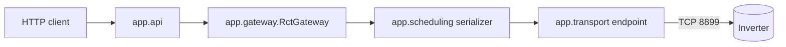

# Architecture

The package is `app`; `run.py` and `python -m app` start it. The wire protocol is
described in the [Protocol Specification](../reference/protocol.md).

## Modules

| Package | Role |
| --- | --- |
| `app/__main__.py` | CLI: `serve`, `validate` |
| `app/config.py` | Settings loading and validation |
| `app/admin` | Admin sessions, password setup, encrypted SQLite persistence, PATs, GUI templates and local assets |
| `app/api` | FastAPI app factory (`app_factory.py`), routers, RFC 9457 problems, middleware, body limit, server |
| `app/security` | PAT format and verification, rate limit, client address |
| `app/gateway` | `DeviceGateway` port and vendor-neutral DTOs (`base.py`); `RctGateway` (`rct.py`) is the only adapter that turns metric names into frames |
| `app/catalog` | Object registry loaded from `app/catalog/objects.json` |
| `app/allowlist.py` | Validates write targets and values; admin selection is persisted in `data/rct.db` |
| `app/protocol` | Frames, CRC, escaping, stream parser, value codecs, `net.slave_data` |
| `app/transport` | `TransportEndpoint` owns the TCP connection to one endpoint; demultiplexer, receiver, send gate |
| `app/scheduling` | Access serializer (one worker and bounded FIFO queue per endpoint), work budget, retry, single-flight, periodic reads, heartbeat, shutdown |
| `app/cache.py` | Value store with freshness handling |
| `app/observability` | Prometheus exporter, names and statistics |

## Request path

A request is authenticated and rate limited in the API layer, resolved to a
device and metric through the catalog, and handed to the gateway. The gateway
submits a transaction to the endpoint's serializer, which executes one
transaction at a time against the inverter. Reads may be served from the cache;
`fresh=true` forces a device transaction.

## Adapter port

Another device vendor implements the `DeviceGateway` protocol from
`app/gateway/base.py` and fills the same DTOs, without changing paths, error
keys or status codes.
